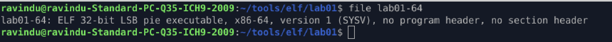
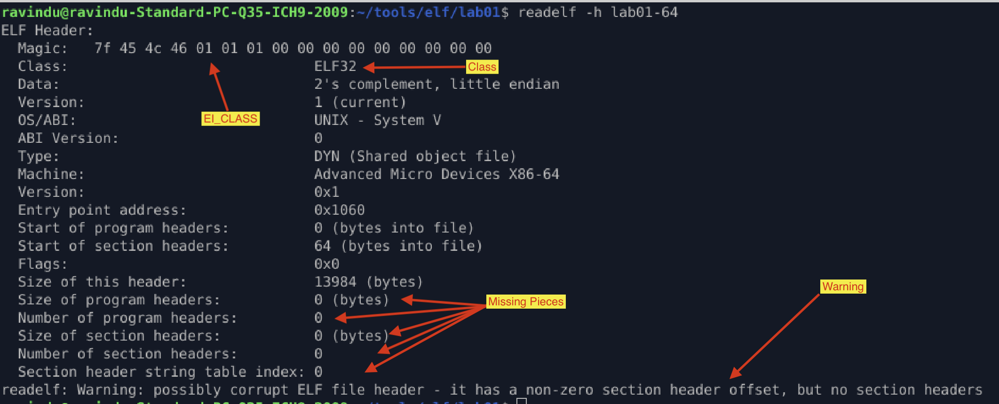
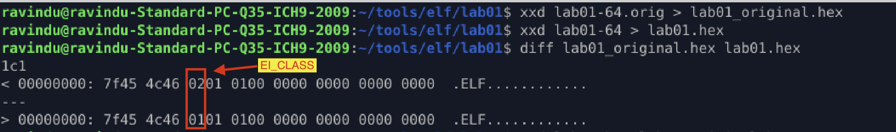

# lab_02_EI_CLASS_Is_Not_Truth

## Purpose

* Change `EI_CLASS` and observe **runtime behavior vs analysis tools assumptions**.

## Method

1. Modify `e_ident[EI_CLASS]`

   * `01` → ELF32
   * `02` → ELF64
2. Observe execution and tool outputs.

## Observations

1. I changed a **64-bit ELF** binary’s `EI_CLASS` to **32-bit**, but the program still executed without any issue.

2. When analyzing the modified binary using `file`, `readelf`, and `binwalk`, all tools reported the binary as **32-bit** and failed to correctly locate program headers and segments.

   This happens because:

   * ELF32 and ELF64 use **different structure sizes and offsets**
   * Tools rely on `EI_CLASS` to decide how to parse the file
   * Once `EI_CLASS` is incorrect, parsers interpret offsets incorrectly

## Verification

1. `file` tool result

2. `readelf` tool result

3. `binwalk` tool result

4. Compare the original vs the changed programs to prove what exactly changed

---

## What I Learned

* Analysis tools rely on **assumptions encoded in metadata**
* Execution behavior depends on **actual memory mapping**, not tool interpretation
* Tools should be used for **verification**, not as the source of truth

---

> *“This experiment helped me understand which ELF header fields are authoritative for execution and which are primarily used by tooling.”*

---