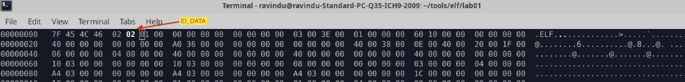
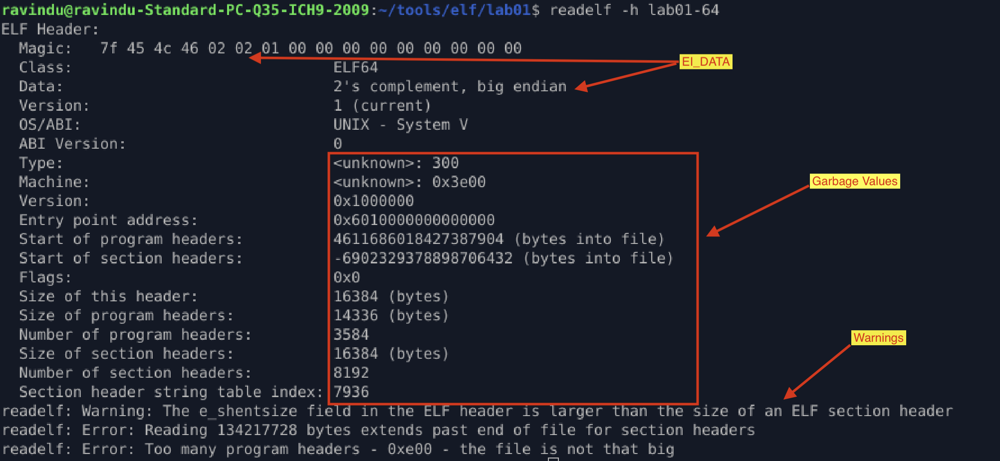
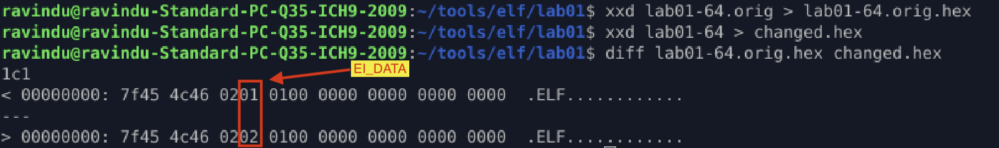

# EI_DATA corruption experiment

## Purpose

Change `e_ident[EI_DATA]` and observe **runtime behavior vs analysis tools assumptions**.

## Method

1. Modify `e_ident[EI_DATA]`

   * `01` → little endian
   * `02` → big endian

2. Observe execution and tool outputs.

## Observation

1. I changed `e_ident[EI_DATA]` to big endian. but the program still executed without any issue.

2. When analyzing the modified binary using `file`, `readelf`, and `binwalk`, a few but important things happened
    * `file` tool totally failed to identify binary file content.
    * `binwalk` tool also failed same as `file` tool.
    * The `readelf` tool shows results, but that totally wrong assumptions, and also this tool reports a few issues.

    This happens because:
   * Linux x86-64 kernels assume native little-endian execution regardless of EI_DATA

   * The kernel ELF loader does not rely on EI_DATA to determine byte order

   * Userland analysis tools strictly trust EI_DATA and parse multi-byte fields accordingly

   * As a result, tools misinterpret header fields, while execution remains unaffected

## Verification

1. `file` tool result

2. `readelf` tool result

3. `binwalk` tool result

4. Compare the original vs the changed programs to prove what exactly changed

---

## What I Learned

* Analysis tools rely on **assumptions encoded in metadata**
* Execution behavior depends on how the kernel ELF loader interprets the binary, not how userland analysis tools interpret metadata.
* Tools should be used for **verification**, not as the source of truth
* Some ELF header fields are advisory for tools, not enforced by the kernel

---

> *“This experiment helped me understand which ELF header fields are authoritative for execution and which are primarily used by tooling.”*

--- 