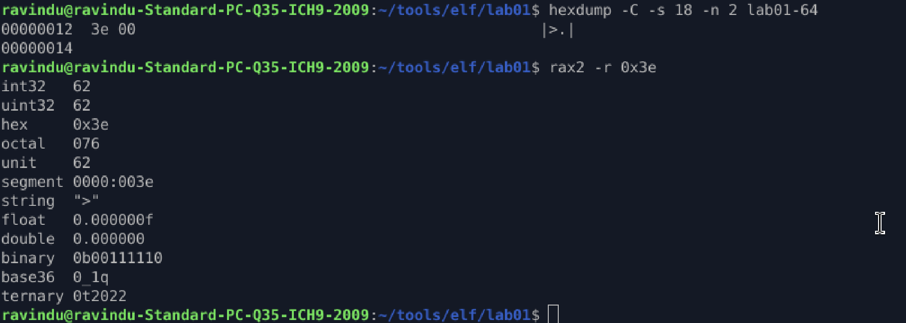
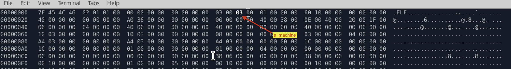
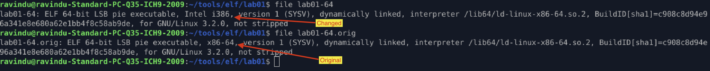
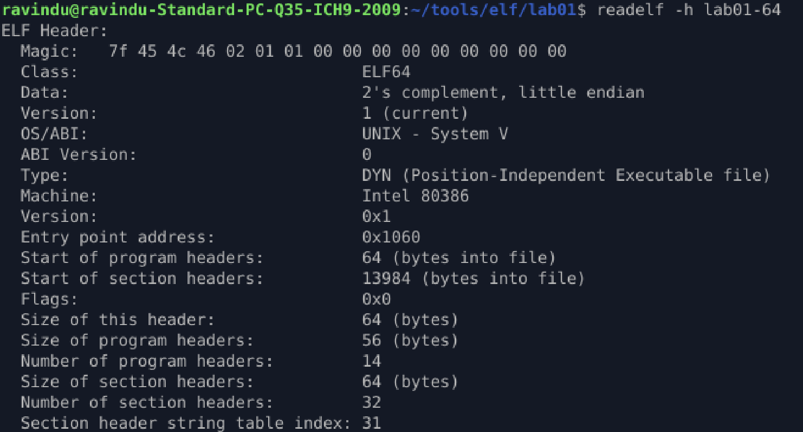
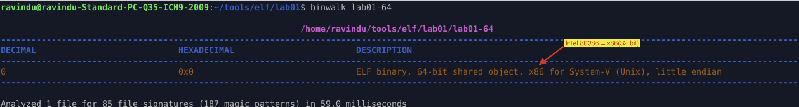
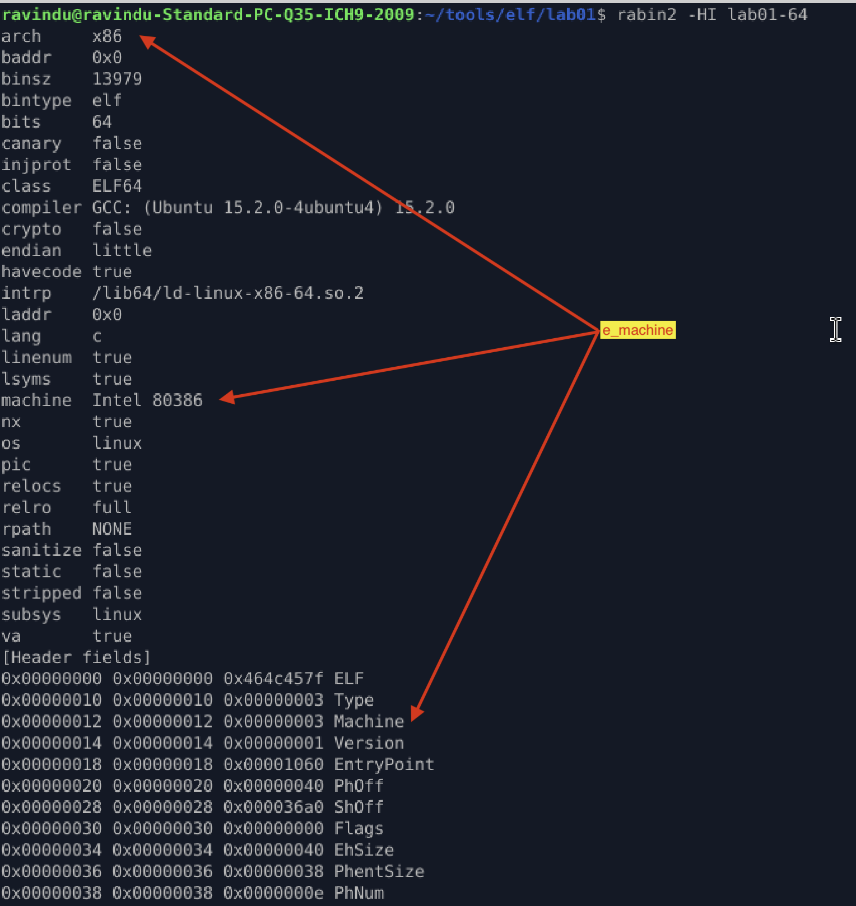
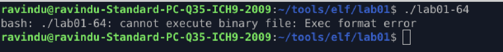
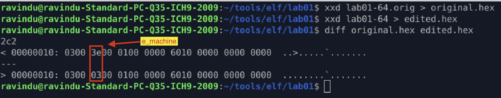

# **e_machine Is Not the CPU**

## Purpose

Change `e_machine` and observe **runtime behavior vs analysis tools assumptions**.

---

## Method

### 1. Identify the current `e_machine` value

* Dump the ELF header field:

  * `hexdump -C -s 18 -n 2 lab01-64`
* Convert the value:

  * `rax2 -r <value>`

From this, the current `e_machine` value is:

* **62** → **AMD x86-64 architecture**



---

### 2. Modify `e_machine` using different values


> ⚠️ Only the `e_machine` field is modified.
> All other ELF header fields and program contents remain identical.

| Name | Value | Meaning |
|------|-------|---------|
| EM_NONE | 0 | No machine |
| EM_M32 | 1 | AT&T WE 32100 |
| EM_SPARC | 2 | SPARC |
| EM_386 | 3 | Intel 80386 |
| EM_68K | 4 | Motorola 68000 |
| EM_88K | 5 | Motorola 88000 |
| reserved | 6 | Reserved for future use (was EM_486) |
| EM_860 | 7 | Intel 80860 |
| EM_MIPS | 8 | MIPS I Architecture |
| EM_S370 | 9 | IBM System/370 Processor |
| EM_MIPS_RS3_LE | 10 | MIPS RS3000 Little-endian |
| reserved | 11–14 | Reserved for future use |
| EM_PARISC | 15 | Hewlett-Packard PA-RISC |
| reserved | 16 | Reserved for future use |
| EM_VPP500 | 17 | Fujitsu VPP500 |
| EM_SPARC32PLUS | 18 | Enhanced instruction set SPARC |
| EM_960 | 19 | Intel 80960 |
| EM_PPC | 20 | PowerPC |
| EM_PPC64 | 21 | 64-bit PowerPC |
| EM_S390 | 22 | IBM System/390 Processor |
| reserved | 23–35 | Reserved for future use |
| EM_V800 | 36 | NEC V800 |
| EM_FR20 | 37 | Fujitsu FR20 |
| EM_RH32 | 38 | TRW RH-32 |
| EM_RCE | 39 | Motorola RCE |
| EM_ARM | 40 | Advanced RISC Machines ARM |
| EM_ALPHA | 41 | Digital Alpha |
| EM_SH | 42 | Hitachi SH |
| EM_SPARCV9 | 43 | SPARC Version 9 |
| EM_TRICORE | 44 | Siemens TriCore embedded processor |
| EM_ARC | 45 | Argonaut RISC Core |
| EM_H8_300 | 46 | Hitachi H8/300 |
| EM_H8_300H | 47 | Hitachi H8/300H |
| EM_H8S | 48 | Hitachi H8S |
| EM_H8_500 | 49 | Hitachi H8/500 |
| EM_IA_64 | 50 | Intel IA-64 processor architecture |
| EM_MIPS_X | 51 | Stanford MIPS-X |
| EM_COLDFIRE | 52 | Motorola ColdFire |
| EM_68HC12 | 53 | Motorola M68HC12 |
| EM_MMA | 54 | Fujitsu MMA Multimedia Accelerator |
| EM_PCP | 55 | Siemens PCP |
| EM_NCPU | 56 | Sony nCPU embedded RISC processor |
| EM_NDR1 | 57 | Denso NDR1 microprocessor |
| EM_STARCORE | 58 | Motorola Star*Core processor |
| EM_ME16 | 59 | Toyota ME16 processor |
| EM_ST100 | 60 | STMicroelectronics ST100 processor |
| EM_TINYJ | 61 | Advanced Logic Corp. TinyJ |
| EM_X86_64 | 62 | AMD x86-64 architecture |
| EM_PDSP | 63 | Sony DSP Processor |
| EM_PDP10 | 64 | DEC PDP-10 |
| EM_PDP11 | 65 | DEC PDP-11 |
| EM_FX66 | 66 | Siemens FX66 microcontroller |
| EM_ST9PLUS | 67 | STMicroelectronics ST9+ microcontroller |
| EM_ST7 | 68 | STMicroelectronics ST7 |
| EM_68HC16 | 69 | Motorola MC68HC16 |
| EM_68HC11 | 70 | Motorola MC68HC11 |
| EM_68HC08 | 71 | Motorola MC68HC08 |
| EM_68HC05 | 72 | Motorola MC68HC05 |
| EM_SVX | 73 | Silicon Graphics SVx |
| EM_ST19 | 74 | STMicroelectronics ST19 |
| EM_VAX | 75 | Digital VAX |
| EM_CRIS | 76 | Axis Communications CRIS |
| EM_JAVELIN | 77 | Infineon Javelin |
| EM_FIREPATH | 78 | Element 14 FirePath |
| EM_ZSP | 79 | LSI Logic ZSP DSP |
| EM_MMIX | 80 | Donald Knuth’s MMIX |
| EM_HUANY | 81 | Harvard University machine-independent |
| EM_PRISM | 82 | SiTera Prism |
| EM_AVR | 83 | Atmel AVR |
| EM_FR30 | 84 | Fujitsu FR30 |
| EM_D10V | 85 | Mitsubishi D10V |
| EM_D30V | 86 | Mitsubishi D30V |
| EM_V850 | 87 | NEC v850 |
| EM_M32R | 88 | Mitsubishi M32R |
| EM_MN10300 | 89 | Matsushita MN10300 |
| EM_MN10200 | 90 | Matsushita MN10200 |
| EM_PJ | 91 | picoJava |
| EM_OPENRISC | 92 | OpenRISC 32-bit |
| EM_ARC_A5 | 93 | ARC Cores Tangent-A5 |
| EM_XTENSA | 94 | Tensilica Xtensa |
| EM_VIDEOCORE | 95 | Alphamosaic VideoCore |
| EM_TMM_GPP | 96 | Thompson Multimedia GPP |
| EM_NS32K | 97 | National Semiconductor 32000 |
| EM_TPC | 98 | Tenor Network TPC |
| EM_SNP1K | 99 | Trebia SNP 1000 |
| EM_ST200 | 100 | STMicroelectronics ST200 |
|----------|-----|--------------------------|

---

### 3. Observe execution and tool outputs



---

## Observation

1. `e_machine` was changed from **62 (x86-64)** to **3 (Intel 80386)**.

2. The behavior is **very different** compared to EI_CLASS and EI_DATA experiments:

   * Analysis tools **fully trust** the new `e_machine` value.
   * The Linux kernel **refuses execution** with:

     ```
     Exec format error
     ```

3. Key differences observed:

   * Tools interpret the binary as a **different architecture**
   * The kernel loader performs a **strict architecture compatibility check**

### Why this happens

* When executing an ELF binary, the Linux kernel:

  * Reads `e_machine`
  * Verifies it matches the **current CPU architecture**
* If the value does **not** match the running system:

  * Execution is aborted **before program loading**
  * Resulting in `Exec format error`

Unlike `EI_CLASS` or `EI_DATA`, **`e_machine` is enforced by the kernel**.

---

## Verification

1. `file` output



2. `readelf` output



3. `binwalk` output



4. `rabin2` output



5. execution format error



6. Binary comparison (original vs modified)



---

## What I Learned

* `e_machine` is a **kernel-authoritative field**, not just metadata
* Unlike other ELF identity fields, it is **strictly validated at runtime**
* The kernel enforces architecture compatibility **before loading segments**
* This explains why:

  * Some ELF fields can lie safely
  * But `e_machine` **cannot** (on native execution)

> **e_machine describes what the kernel is willing to execute — not what the CPU could theoretically run.**

---
