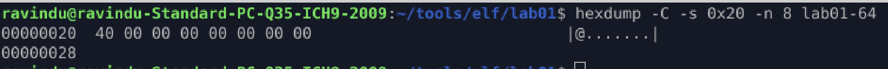
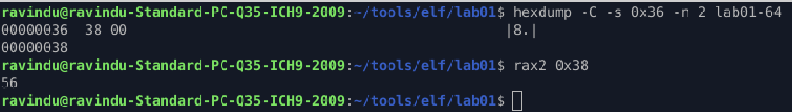
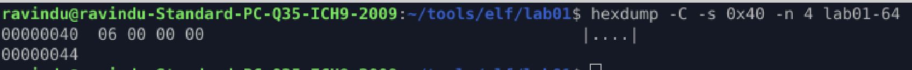
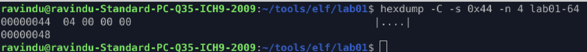
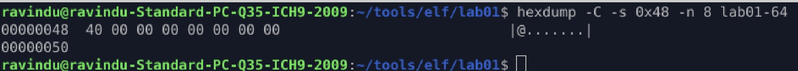
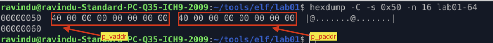
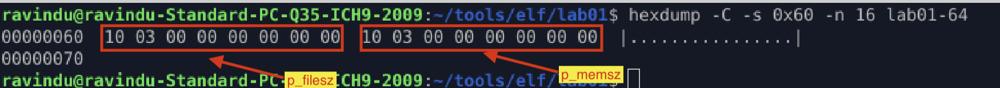
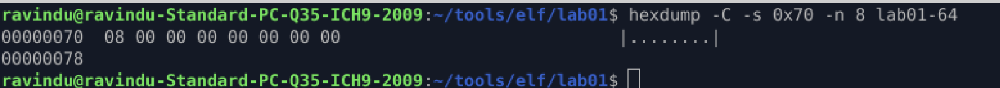
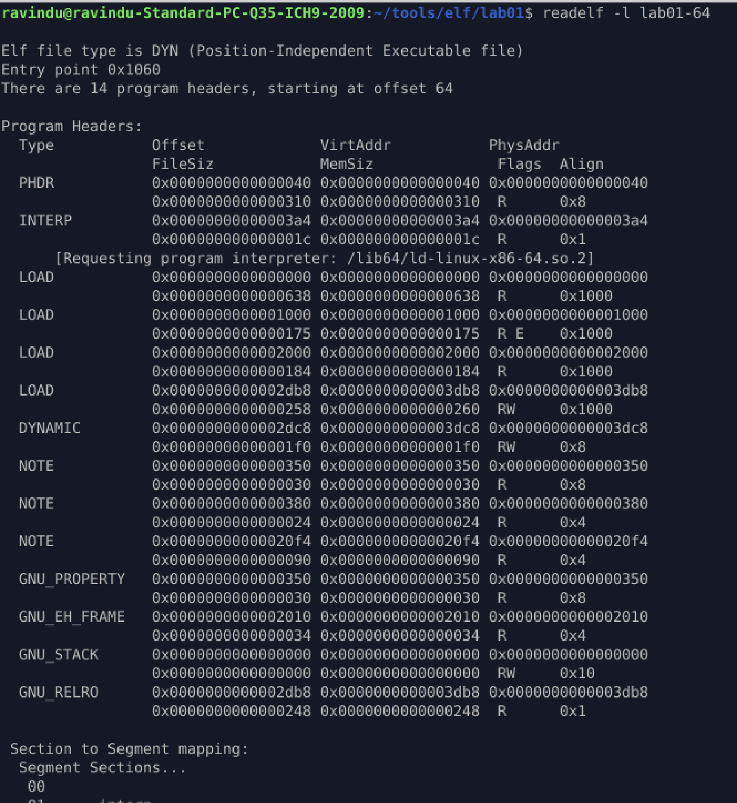

# Identify Program Headers

## Purpose

Find program header using `ELF header`.

## Extract program header info from ELF header

1. First we should extract three things from `ELF header`.
    * e_phoff = program header starting address
    * e_phentsize = size of one program header
    * e_phnum = Number of program header entries

2. Find exact data
    1. e_phoff
        * `hexdump -C -s 0x20 -n 8 lab01-64`
        * in our case start from 0x40
        
    2. e_phentsize
        * `hexdump -C -s 0x36 -n 2 lab01-64`
        * in our case program header size is 56
        
    3. e_phnum
        * `hexdump -C -s 0x38 -n 2 lab01-64`
        * in our program has 14 program headers
        

## ELF64 Program Header Map (56 Bytes)

| Byte offset(inside header) | Field Name | Size | Description |
|----------------------------|------------|------|-------------|
| 0x00 | p_type | 4B | 01 = `PT_LOAD` (executable code/data). |
| 0x04 | p_flags | 4B | 05 = R-X, 06 = RW-, 07 = RWE (Suspicious!) |
| 0x08 | p_offset | 8B | Where this segment starts in the file offset |
| 0x10 | p_vaddr | 8B | The virtual address where it wants to live in RAM |
| 0x18 | p_paddr | 8B | Physical address (usually ignored on Linux) |
| 0x20 | p_filesz | 8B | How many bytes to read from the file |
| 0x28 | p_memsz | 8B | How much space to occupy in RAM |
| 0x30 | p_align | 8B | Memory alignment (e.g., 00 10 00 00 for 4KB) |
|------|---------|----|----------------------------------------------|

## Segment Types, p_type

| Name | Value |
|------|-------|
| PT_NULL| 0 |
| PT_LOAD | 1 |
| PT_DYNAMIC | 2 |
| PT_INTERP | 3 |
| PT_NOTE | 4 |
| PT_SHLIB | 5 |
| PT_PHDR | 6 |
| PT_TLS | 7 |
| PT_LOOS | 0x60000000 |
| PT_HIOS | 0x6fffffff |
| PT_LOPROC | 0x70000000 |
| PT_HIPROC | 0x7fffffff |
|-----------|------------|

## Segment Flag Bits, p_flags

| Name | Value | Meaning |
|------|-------|---------|
| PF_X | 0x1 | Execute |
| PF_W | 0x2 | Write |
| PF_R | 0x4 | Read | 
| PF_MASKO | 0x0ff00000 | Unspecified |
| PF_MASKPROC | 0xf0000000 | Unspecified |
|-------------|------------|-------------|

## Segment Permissions

| Flags | Value | Permission | 
|-------|-------|-------|
| none | 0 | All Access Denied |
| PF_X | 1 | Execute only |
| PF_W | 2 | Write only | 
| PF_W+PF_X | 3 | Write, execute | 
| PF_R | 4 | Read only | 
| PF_R+PF_X | 5 | Read, execute | 
| PF_R+PF_W | 6 | Read, write | 
| PF_R+PF_W+PF_X | 7 | Read, write, execute | 
|----------------|---|----------------------|

## Extract 1st program header from our program

1. Extract `p_type`
    * hexdump -C -s 0x40 -n 4 lab01-64
    * in our program p_type is 6. (6 = PT_PHDR)
    

2. Extract `p_flags`
    * hexdump -C -s 0x44 -n 4 lab01-64
    * permission 0x4 (read only)
    

3. Extract `p_offset`
    * hexdump -C -s 0x48 -n 8 lab01-64
    * offset = 0x40(64)
    

4. Extract `p_vaddr` & `p_paddr`
    * hexdump -C -s 0x50 -n 16 lab01-64
    * p_vaddr = 0x40
    * p_paddr = 0x40
    

5. Extract `p_filesz` & `p_memsz`
    * hexdump -C -s 0x60 -n 16 lab01-64
    * p_filesz = 0x310(784 bytes)
    * p_memsz = 0x310(784 bytes)
    

6. Extract `p_align`
    * hexdump -C -s 0x70 -n 8 lab01-64
    * p_align = 0x8(8 bytes)
    * PT_PHDR often has small alignment; PT_LOAD alignment controls page mapping.
    

## Extract program headers using tools

1. `readelf -l lab01-64`

