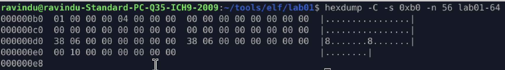
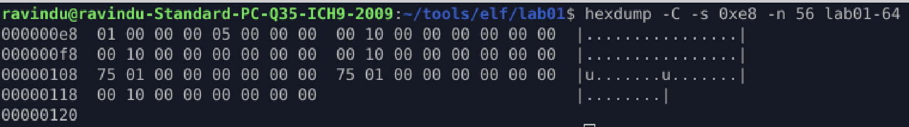
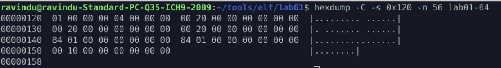
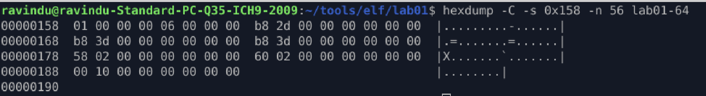

# Memory map

## Purpose 

Draw a memory map using `PT_LOAD`.

## Categorise we found program headers

Our program has 14 headers and each one 56 bytes long

1. 1st PT_LOAD 
    * type = PT_LOAD
    * flags = read only
    * offset = 0x0
    * p_vaddr = 0x0
    * p_paddr = 0x0 
    * p_filesz = 0x638(1592 bytes)
    * p_memsz = 0x638(1592 bytes)
    * p_align = 0x1000
    

2. 2nd PT_LOAD
    * type = PT_LOAD
    * flags = read and execute
    * offset = 0x1000
    * p_vaddr = 0x1000
    * p_paddr = 0x1000
    * p_filesz = 0x175(373 bytes)
    * p_memsz = 0x175(373 bytes)
    * p_align = 0x1000
    

3. 3rd_PT_LOAD
    * type = PT_LOAD
    * flags = read only
    * offset = 0x2000
    * p_vaddr = 0x2000
    * p_paddr = 0x2000
    * p_filesz = 0x184(388 bytes)
    * p_memsz = 0x184(388 bytes)
    * p_align = 0x1000
    

4. 4th_PT_LOAD
    * type = PT_LOAD
    * flags = read and write 
    * offset = 0x2db8
    * p_vaddr = 0x3db8
    * p_paddr = 0x3db8
    * p_filesz = 0x258(600 bytes)
    * p_memsz = 0x260(608 bytes)
    * p_align = 0x1000
    

## Memory Range Calculation Rule

When drawing a memory map, **always use `p_vaddr` and `p_memsz`**.

The Linux loader maps memory based on **virtual addresses**, not physical ones.

### Correct Formula

Memory range for a segment:

    start = p_vaddr
    end   = p_vaddr + p_memsz

### Important Notes

- `p_vaddr` → where the segment is mapped in virtual memory
- `p_memsz` → total size occupied in memory
- `p_offset` and `p_filesz` are **file-related**, not memory-related
- `p_paddr` is ignored by the Linux kernel
- Any gap where `p_memsz > p_filesz` is **zero-initialized (BSS)**

### Loader Reality

The kernel:
1. Maps `p_memsz` bytes at `p_vaddr`
2. Copies `p_filesz` bytes from file offset `p_offset`
3. Zero-fills the remaining memory

> **Memory maps are derived from program headers, not sections.**

## Memory Map

| PT_LOAD | File Range | memory Range | Perms |
|---------|------------|-------------|-------|
| #1 | 0x000000 - 0x000638 | 0x000000 - 0x000638 | R-- |
| #2 | 0x001000 - 0x001175 | 0x001000 - 0x001175 | R-X |
| #3 | 0x002000 - 0x002184 | 0x002000 - 0x002184 | R-- |
| #4 | 0x002db8 - 0x003010 | 0x003db8 - 0x003018 | RW- |
|----|---------------------|---------------------|-----|