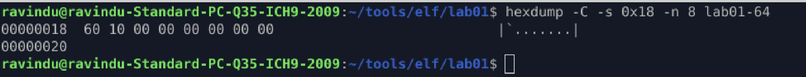
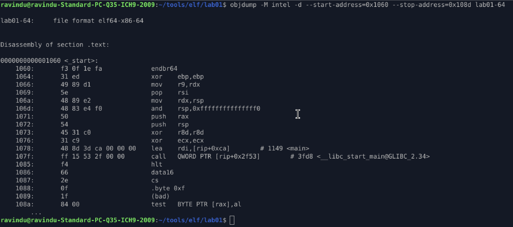
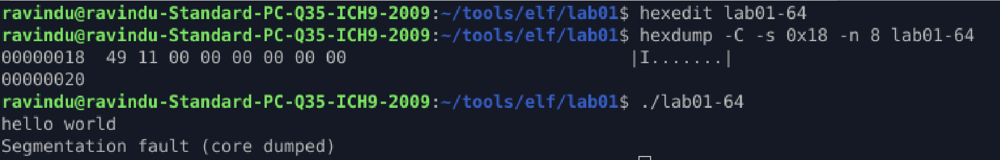

# **Lab 06 — `e_entry` Is Just a Pointer**

## **Purpose**

Demonstrate that `e_entry` is **not** “the start of main” —
it is simply the **first instruction the CPU executes**, and it can point anywhere inside an executable `PT_LOAD` segment.

This lab proves:

> **The ELF header controls execution, not the source code.**

---

## **1. Locate `e_entry`**

The `e_entry` field is stored at offset `0x18` in ELF64.

```
hexdump -C -s 0x18 -n 8 lab01-64
```

Result:

```
00000018  60 10 00 00 00 00 00 00
```

So:

```
e_entry = 0x1060
```



---

## **2. Identify where `e_entry` lives in memory**

From the memory map:

| PT_LOAD | File Range          | Memory Range        | Perms |
| ------- | ------------------- | ------------------- | ----- |
| #1      | 0x000000 – 0x000638 | 0x000000 – 0x000638 | R--   |
| #2      | 0x001000 – 0x001175 | 0x001000 – 0x001175 | R-X   |
| #3      | 0x002000 – 0x002184 | 0x002000 – 0x002184 | R--   |
| #4      | 0x002db8 – 0x003010 | 0x003db8 – 0x003018 | RW-   |

`0x1060` falls inside:

```
PT_LOAD #2  (R-X)
0x001000 – 0x001175
```

So the kernel will legally execute instructions there.

This confirms:

> `e_entry` must point inside an **executable PT_LOAD**, or the kernel will crash.

---

## **3. Disassemble the real entrypoint**

Disassemble around `e_entry`:

```
objdump -M intel -d \
  --start-address=0x1060 \
  --stop-address=0x108d \
  lab01-64
```



This code is `_start`.

This shows the real boot flow:

```
kernel → _start → __libc_start_main → main
```

`main()` is **not** the ELF entrypoint — `_start` is.

---

## **4. Point `e_entry` directly to `main`**

Find `main`:

```
nm -n lab01-64 | grep main
```

Result:

```
0000000000001149 T main
```

So:

```
main = 0x1149
```

Now overwrite `e_entry` to `0x1149`:



Run:

```
./lab01-64
```

Output:

```
hello world
Segmentation fault
```

---

## **5. Why it crashes**

By pointing `e_entry` to `main`, we bypass `_start`.

That means:

* No stack setup
* No argc / argv
* No libc initialization
* No `exit()` path

So `main()` runs, prints, then returns into **garbage memory** → crash.

This proves:

> **`e_entry` is not a function pointer.
> It is raw CPU control.**

The kernel does not know or care about `main()`.
It jumps to whatever address you put in `e_entry`.

---

## **Final Truth**

`e_entry` defines **where execution begins** — not what the program is.

If it points to:

* `_start` → normal program
* `main` → broken runtime
* shellcode → malware loader
* garbage → crash

This field alone can turn a normal ELF into a loader, packer, or implant.

---
