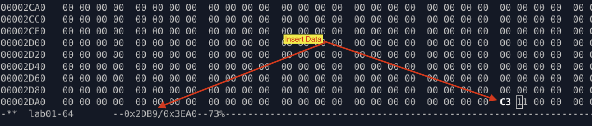
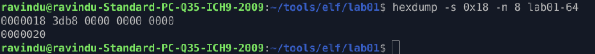
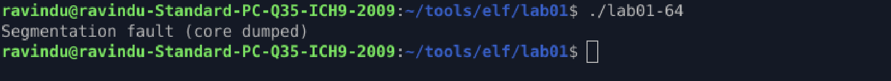

# **Lab — Memory Permissions Control Execution**

## **Purpose**

Demonstrate that `e_entry` controls **where execution starts**, and that **memory permissions (NX)** decide whether code placed there can run.

We redirect `e_entry` into a **RW (non‑executable)** PT_LOAD segment and observe what happens.

---

## **Setup**

We choose a PT_LOAD segment that is **RW** (the `.bss`-backed segment):

```
File offset range : 0x002db8 – 0x003010
Virtual address   : 0x003db8 – 0x003018
```

Important detail:

This segment has:

```
p_filesz < p_memsz
```

So only the **file-backed part** survives on disk.
Anything written into the `memsz-only` part will be zeroed by the loader.

Therefore, we must patch inside:

```
[file offset range] → 0x002db8
```

We write one byte:

```
c3   ; ret
```



Now we redirect the ELF entrypoint:

```
e_entry → 0x003db8
```



This makes the loader jump into the RW segment.

---

## **What the loader does**

Linux does:

```
mmap( RW PT_LOAD ) → memory @ 0x003db8
mmap( RX PT_LOAD ) → code
…
RIP = e_entry
```

So execution flow becomes:

```
kernel → ld-linux → dl_main → jump to 0x003db8
```

That is our `.bss` segment.

---

## **Observation**

The program immediately crashes:

```
SIGSEGV inside ld-linux (dl_main)
```



This is expected.

The CPU attempted to execute instructions at:

```
0x003db8
```

but that memory page has permissions:

```
RW (no execute bit)
```

The kernel blocks execution because of **NX (No‑Execute)** protection.

So instead of running `c3`, the process is killed.

---

## **What this proves**

Even though we cannot see our `ret` execute, we **did** prove three things:

1. **`e_entry` is obeyed**
   The dynamic loader really tried to transfer control to `0x003db8`.

2. **`e_entry` is a virtual address**
   We edited file offset `0x2db8`, but execution was attempted at virtual `0x3db8`.

3. **Memory permissions override everything**
   Code in an RW segment is not executable, even if it is the ELF entrypoint.

This is exactly how NX protects modern binaries.

---