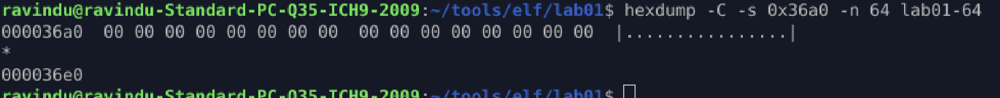
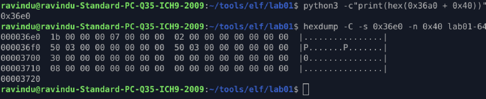
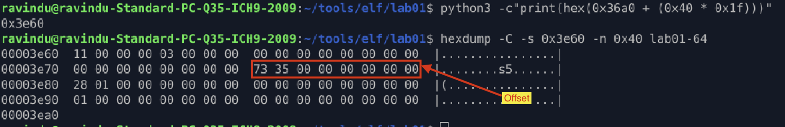
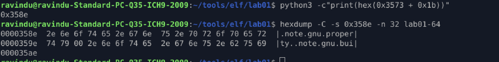

# Section Header Identity

## Purpose

Find section headers using `ELF header`

## Extract section header info from ELF header

1. First we should extract three things from `ELF header`.

| Offset | Field | Size | Description |
|--------|-------|------|-------------|
| 0x28 | e_shoff | 8 bytes | Start of Section Header Table (The file offset). |
| 0x3c | e_shnum | 2 bytes | Number of Sections (How many blocks to read). |
| 0x3E | e_shstrndx | 2 bytes | Section Name String Table Index (The "dictionary" for names). |
| 0x3a | e_shentsize | 2 bytes | Size of one Section Header |
|------ | ------| ----- | ---- |

* in our program, these are the entries
    * e_shoff = 0x36a0
    * e_shnum = 0x20 (total table count)
    * e_shstrndx = 0x1f (31 table is string table)
    * e_shentsize = 0x40(size)

2. First section header
    * In ELF files, the very first section header (Index 0) is always all zeros. It’s a mandatory empty placeholder.

        * hexdump -C -s 0x36a0 -n 0x40 lab01-64
        

ELF64 Section Header Map (64 Bytes / 0x40)

| Offset | Field Name | Size | Significance |
|--------|------------|------|--------------|
| 0x00 | sh_name | 4B | index into .shstrtab |
| 0x04 | sh_type | 4B | 01=Code/Data, 02=Symbol Table, 03=String Table, 08=BSS. |
| 0x08 | sh_flags | 8B | 06 (Alloc/Exec) is normal for code. 07 (RWE) is a Red Flag. |
| 0x10 | sh_addr | 8B | The virtual address where this section sits in RAM. |
| 0x18 | sh_offset | 8B | CRITICAL: The exact byte location in the file. |
| 0x20 | sh_size | 8B | How many bytes this section spans. |
| 0x28 | sh_link | 4B | Link to another section (e.g., associated string table). |
| 0x2C | sh_info | 4B | Extra info (depends on section type). |
| 0x30 | sh_addralign | 8B | Memory alignment (usually powers of 2). |
| 0x38 | sh_entsize | 8B | If this section holds a table (like symbols), this is the size of 1 entry. |

## Find `sh_name`

1. get a 1st index section header
    * e_shoff = 0x36a0
    * second section header offset = `python3 -c"print(hex(0x36a0 + 0x40))"`
    * sh_name = 0x1b
    

2. find string table
    * e_shstrndx = 0x1f (31 table is string table)
    * offset = `python3 -c"print(hex(0x36a0 + (0x40 * 0x1f)))"`
    * `hexdump -C -s 0x3e60 -n 0x40 lab01-64`
    * offset = 0x3573 
    

3. Find section name
    * string offset = 0x3573 + 0x1b(sh_name)
    * `python3 -c"print(hex(0x3573 + 0x1b))"`
    * extract = hexdump -C -s 0x358e -n 32 lab01-64
    * section name is `.note.gnu.property`
    

## sh_type

| Name | Value |
|------|-------|
| SHT_NULL | 0 |
| SHT_PROGBITS | 1 |
| SHT_SYMTAB | 2 | 
| SHT_STRTAB | 3 |
| SHT_RELA | 4 |
| SHT_HASH | 5 |
| SHT_DYNAMIC | 6 |
| SHT_NOTE | 7 |
| SHT_NOBITS | 8 |
| SHT_REL | 9 |
| SHT_SHLIB | 10 |
| SHT_DYNSYM | 11 |
| SHT_INIT_ARRAY | 14 |
| SHT_FINI_ARRAY | 15 |
| SHT_PREINIT_ARRAY | 16 |
| SHT_GROUP | 17 |
| SHT_SYMTAB_SHNDX | 18 |
| SHT_LOOS | 0x60000000 |
| SHT_HIOS | 0x6fffffff |
| SHT_LOPROC | 0x70000000 |
| SHT_HIPROC | 0x7fffffff |
| SHT_LOUSER | 0x80000000 |
| SHT_HIUSER | 0xffffffff |
| -----------| ---------- |

## important sh_type fields

- `01 00 00 00` (SHT_PROGBITS): This is the "General" type. It means the section contains actual bytes from the file (Code, Constants, etc.).

- `08 00 00 00` (SHT_NOBITS): This section takes up zero bytes on your hard drive but takes up space in RAM.

    - Malware Trick: If you see a NOBITS section that is massive (e.g., 100MB), the malware is likely using it as a buffer to unpack a virus once the program starts.

## sh_flags

This defines the Permissions.

* 0x2 (SHF_ALLOC): Occupies memory at runtime.

* 0x4 (SHF_EXECINSTR): Contains executable machine code.

* 0x1 (SHF_WRITE): The section can be modified.

Red Flag: If you see 07, it means the section is Read/Write/Execute. This is almost always a sign of a "Packer" or "Polymorphic Malware" that changes its own code to avoid detection.

