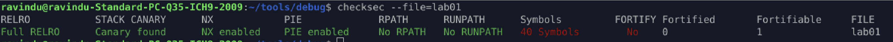
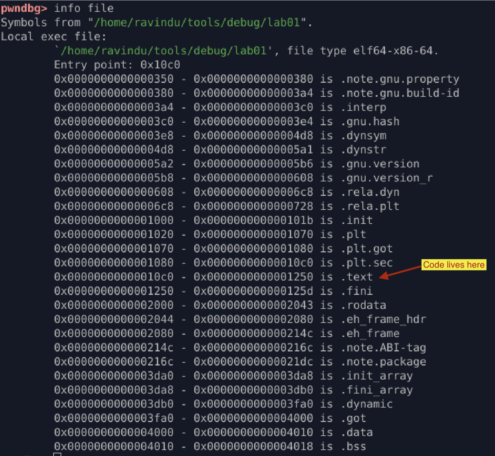
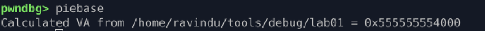
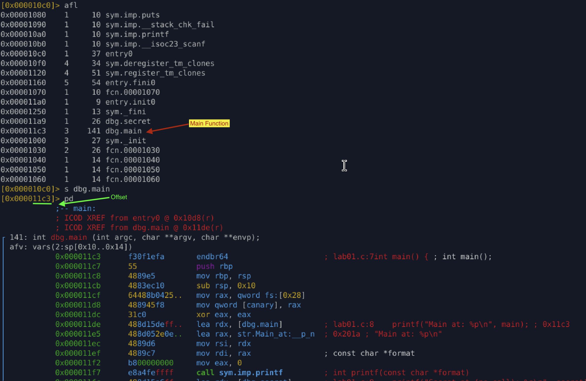
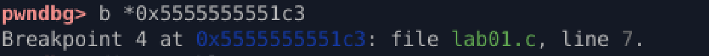
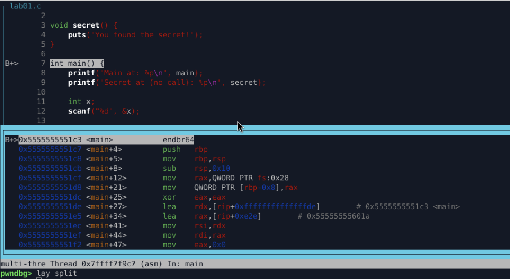
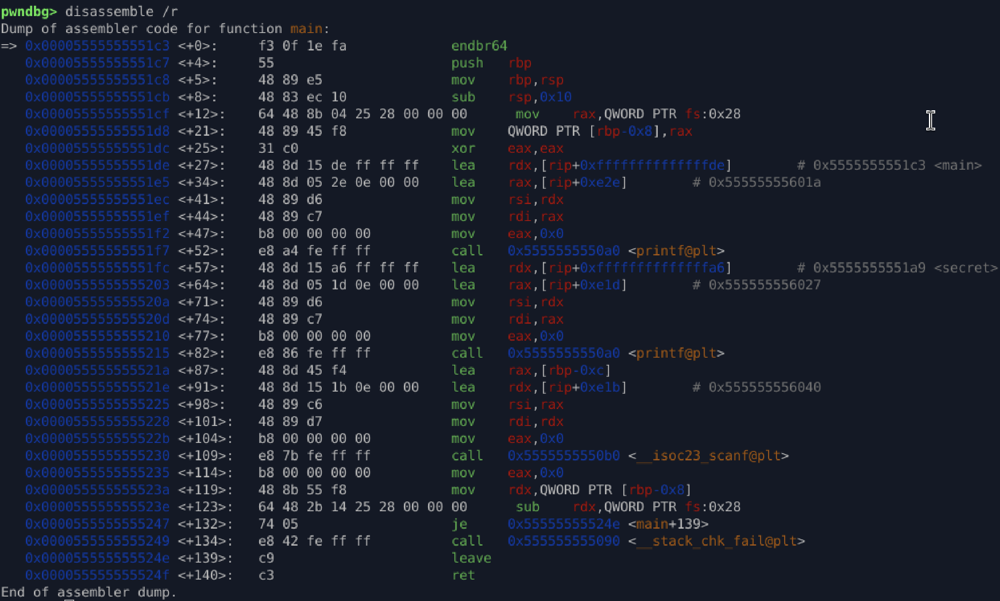

# Lab 01 — PIE Basics & GDB Navigation

## Goal

Understand how PIE affects runtime addresses, how to locate offsets, and how to reliably set breakpoints in PIE binaries using pwndbg + radare2.

---

## 1. Check the security properties



* This confirms the binary is fully position independent.

## 2. Display file info / PIE sections



* Useful for seeing `.text` boundaries, entry point, and segment layout.

## 3. Get the PIE base at runtime



* This is the actual load address GDB uses.

## 4. Compute real addresses
```
runtime address = piebase + offset
```

## 5. Find offsets with radare2

    * r2 -A lab01
    * afl



## 6. Set breakpoints using raw offsets

```
b * (piebase + offset)
```



## 7. Assembly view in GDB




##  What I Learned

- How to find offsets using radare2.  
- How PIE shifts addresses at runtime.  
- How to compute real addresses with PIE.  
- How to set precise breakpoints using offsets.  
- How to use pwndbg layouts for assembly-level debugging.
