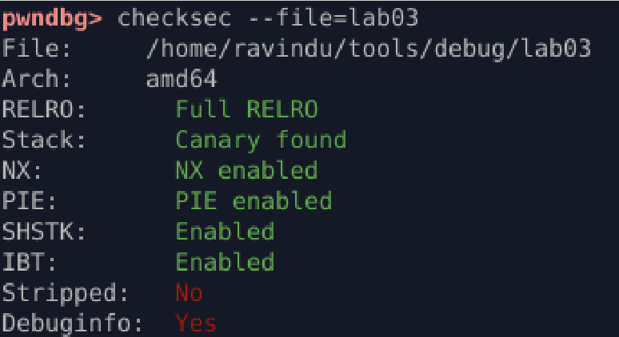
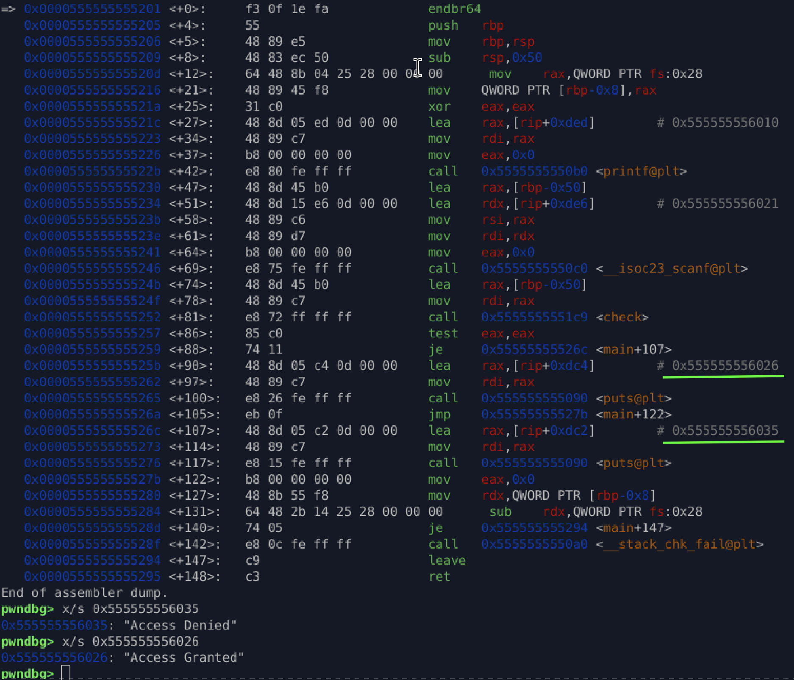
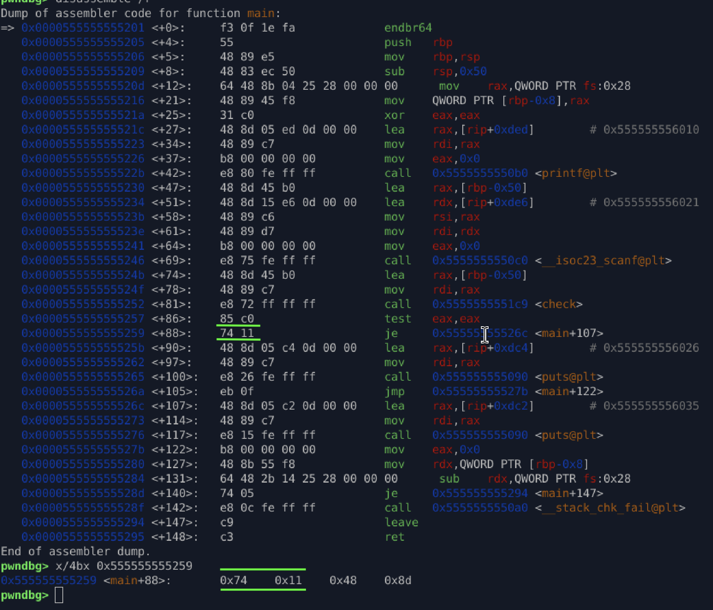
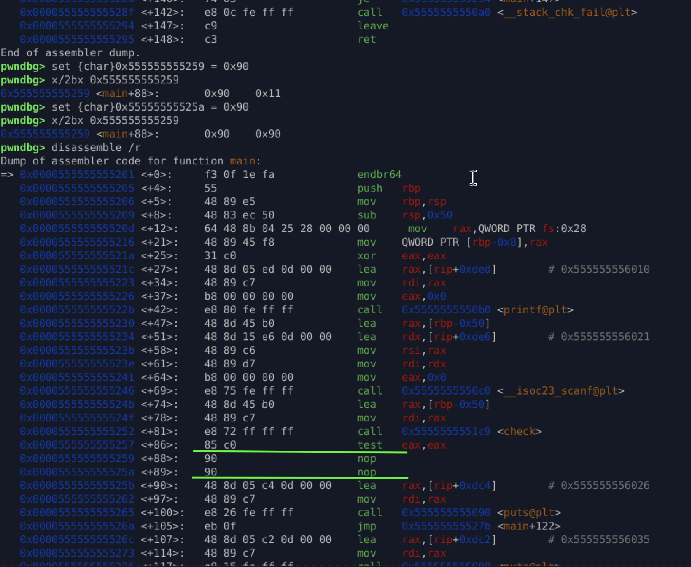
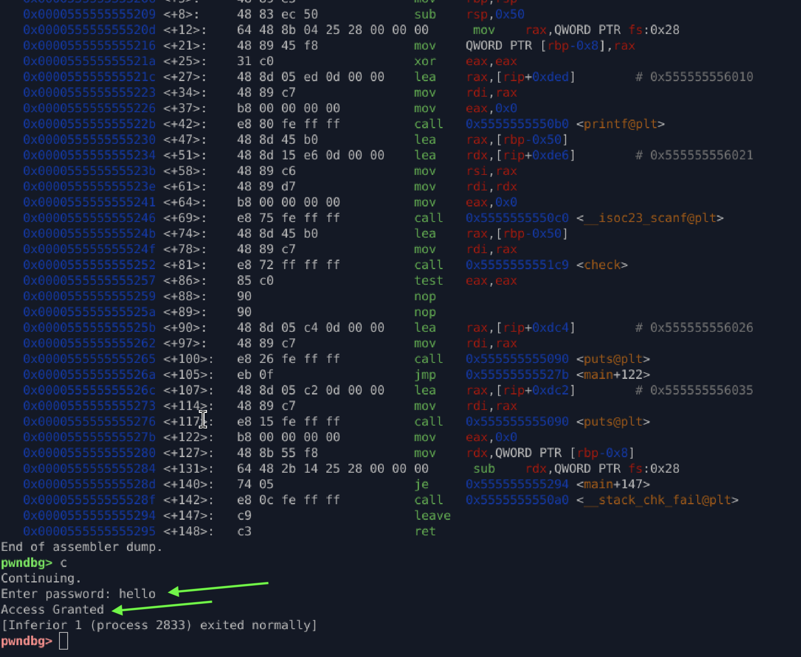

# **Binary Patching Lab – GDB + PIE + pwndbg**

This lab demonstrates how to patch binary instructions at runtime using **GDB**, **pwndbg**, and **manual byte-level patching**.
You will compute PIE-corrected addresses, identify a conditional jump, and override it by writing raw bytes into memory.

---

# **1. Check Security Properties**



Security summary:

| Protection | Status  |
| ---------- | ------- |
| RELRO      | Full    |
| PIE        | Enabled |
| Canary     | Enabled |
| NX         | Enabled |

Because the binary is **PIE-enabled**, all function addresses are randomized at runtime.
So patching requires **offset → runtime address calculation**.

---

# **2. Compute the Runtime Address**

From static analysis:

```
piebase      = 0x555555554000
main offset  = 0x1201
```

Runtime address:

```
main_addr = piebase + offset
          = 0x555555554000 + 0x1201
          = 0x555555555201
```

This is where we will set breakpoints and inspect instructions.

---

# **3. Disassemble main & Identify the Patch Point**



Two string references were found:

```
x/s 0x555555556035  → "Access Denied"
x/s 0x555555556026  → "Access Granted"
```

This suggests a **conditional branch** determines success or failure.

After disassembling `main`, we identify the instruction controlling this logic:

```
0x555555555259:    74 11        je <failure_path>
```

Meaning:

* `74` → opcode for **JE** (jump if equal)
* `11` → relative jump offset

If we want the program to always grant access, we must **neutralize this conditional jump**.

---

## **Inspect the bytes**

```
x/4bx 0x555555555259
```



This confirms:

```
0x…5259 → 0x74  (JE)
0x…525A → 0x11  (jump offset)
```

---

# **4. Patch the Instruction (NOP the Jump)**

We replace both bytes with `0x90`:

```
set {char}0x555555555259 = 0x90
set {char}0x55555555525a = 0x90
```

This transforms:

```
JE <offset>   →   NOP NOP
```

Meaning the program will **never take the "denied" branch** again.

---

# **5. Verify the Patch**

Patched bytes:



Program behavior after patch:



The conditional check is fully bypassed.

---

# **6. What I Learned**

* How PIE affects runtime addresses
* How to calculate:

  ```
  runtime_address = piebase + offset
  ```
* Using radare2 to identify code offsets
* Setting precise breakpoints inside PIE executables
* Locating and understanding conditional jump logic (JE/JNE/JNZ)
* How to patch instructions using **pwndbg**
* How to patch raw bytes using **native GDB memory writes** (most reliable)
* How to verify byte-level patches via memory inspection

---