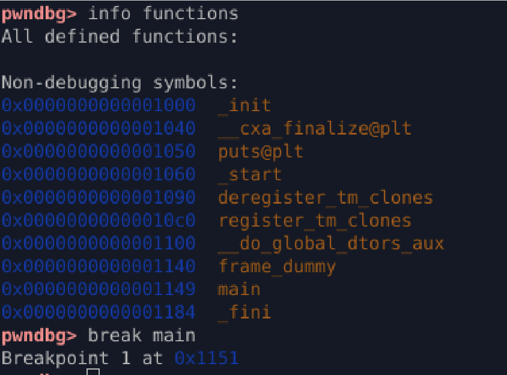
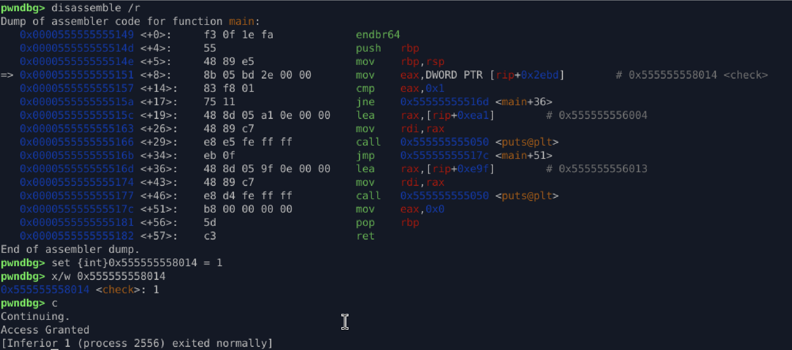

# Runtime Patching: Direct Memory Manipulation

This document details an advanced method of runtime data patching using GDB's ability to write data directly to a specific memory address, bypassing register assignment. This technique is often more robust as it modifies the **source of truth** (the variable's memory location) rather than just a temporary register value.

## Technique Overview

Instead of patching the temporary register (`EAX`) used for comparison, this method involves calculating the absolute memory address of the global variable (`check`) and using the GDB `set` command to write the desired value (`1`) to that exact location.

### 1\. Identify Variable Memory Address

The first critical step is obtaining the absolute memory address where the global variable `check` resides. We use the disassembler output to pinpoint this address:

| Instruction Address | Instruction | Comment/Label |
| :--- | :--- | :--- |
| `0x0000555555555151` | `mov eax,DWORD PTR [rip+0x2ebd]` | **`# 0x555555558014 <check>`** |

The debugger calculated the final address for the `check` variable as **`0x555555558014`**.

### 2\. Determine Data Type and Size

The instruction uses `DWORD PTR`, which signifies a **Double Word** (4 bytes). This corresponds to the `int` type of the `check` variable in the C source code.

  * **Type:** `int`
  * **Address:** `0x555555558014`
  * **Target Value:** `1`

## Execution Steps (GDB/pwndbg)

The following steps were executed in the debugger environment (pwndbg/GDB):

### Step 1: Set Breakpoint and Start Execution

We start the program and halt execution at the beginning of the `main` function.

```gdb
gdb ./program
b main
r
```


### Step 2: Direct Memory Write (The Patch)

We use the GDB `set` command with type casting to directly overwrite the memory location `0x555555558014` with the value `1`.

| Command | Explanation |
| :--- | :--- |
| `set {int}0x555555558014 = 1` | Instructs the debugger to treat the memory at the specified address as an `int` and assign it the value `1`. |

### Step 3: Verify the Patch

Before continuing, you can confirm the new value at the memory address:

```gdb
x/w 0x555555558014
```

### Step 4: Continue Execution

Allow the program to resume.

```gdb
c
```

## Result

By manipulating the global variable's memory location before the comparison instruction (`cmp eax, 0x1`), the program reads the patched value (`1`) into `EAX`, causing the conditional branch to succeed.

```
Access Granted
[Inferior 1 (process 2556) exited normally]
```


### Conclusion

This method successfully demonstrates **data persistence patching**: the actual storage location of the variable was modified. Unlike patching the register, which is volatile, patching the memory ensures that if the variable were accessed again later in the program, it would still hold the patched value of `1`.

-----