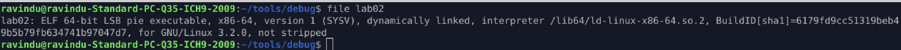
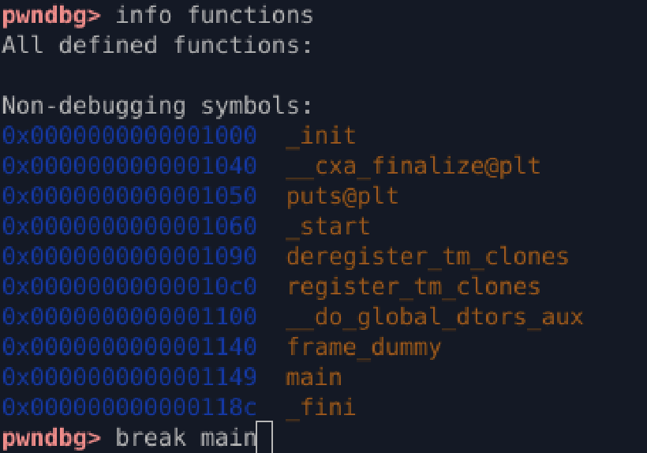
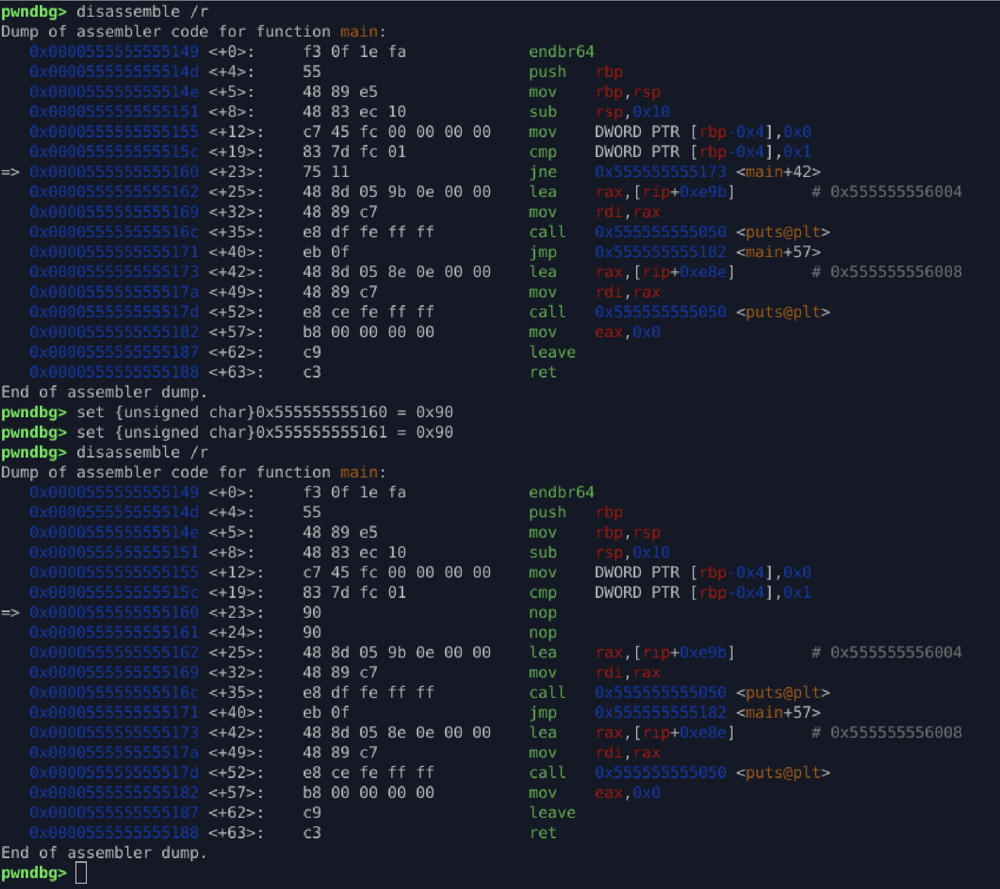

# Instruction Patching: Bypassing Conditional Jumps at Runtime

This document details the process of **runtime instruction patching**, a technique used to alter the execution flow of a running program by replacing conditional jump instructions with non-operational instructions (NOPs) using a debugger.

## Goal

The objective is to modify the program's logic *without recompiling* the source code, forcing it to execute the "WIN" path despite the variable condition being unmet.

**Source Code Analysis:**
The program initializes the integer `x` to `0`. Since the condition `if (x == 1)` evaluates to false, the original output is "LOSE". Our goal is to receive the `"WIN"` message.

```c
#include <stdio.h>

int main() {
    int x = 0; // x is initialized to 0
    if (x == 1) { // Condition is false
        puts("WIN");
    } else {
        puts("LOSE");
    }
}
```

## 1\. Static and Dynamic Program Analysis

Before patching, we analyze the compiled binary to understand its structure and security features.

### 1.1 Binary File Metadata

| Tool | Purpose | Key Finding |
| :--- | :--- | :--- |
| `file` | Check binary type | Non-stripped, meaning function and variable names are retained, which simplifies debugging.  |
| `readelf` | Check file headers | Confirms the architecture, file type (Executable), and endianness.  |
| `checksec` | Security hardening | Identifies protections like PIE, Stack Canary, and NX. This dictates where and how patching can occur.  |




### 1.2 Identifying the Patching Point (`r2` and Assembly)

We use a static analysis tool (`radare2` in this case) to disassemble the `main` function and pinpoint the conditional jump instruction.

1.  Analyze the binary: `r2 -AA lab02`
2.  Analyze functions: `afl`
3.  Print disassembly of `main`: `pdf @ main`

The key area is the conditional check in the disassembled `main` function:

The assembly for the conditional logic typically looks like this:

| Instruction Address | Mnemonic | Byte Code | Function |
| :--- | :--- | :--- | :--- |
| `0x...115c` | `cmp dword [var_4hl, 0x1` | | Compares the variable's value (in `local variable`) with `1`. |
| `0x...1160` | `jne 0x...173` | **`75 11`** | **Jumps if Not Equal** (i.e., if `x != 1`), leading to the "LOSE" block (`0x...173`). |

The instruction `jne 0x...173` is our target. If we prevent this jump, execution will *fall through* to the instruction immediately following it, which is the start of the "WIN" block.


## 2\. Runtime Patching via GDB

We use the GDB debugger (`pwndbg` in the example) to execute the patch in the program's memory.

### Step 1: Set Breakpoint and Disassemble

1.  Start the program in GDB and locate the function: `info functions`
2.  Set a breakpoint at the entry of the `main` function: `break main`
3.  Run the program: `r` (The program halts at the `main` function).
4.  Disassemble the section, including the raw byte codes, to prepare for patching: `disassemble /r`



### Step 2: Instruction Overwrite (NOP-Sledding)

The goal is to replace the 2-byte conditional jump instruction (`jne`) with two 1-byte **NOP** (No Operation) instructions. The NOP instruction's opcode is **`0x90`**.

The jump instruction is typically **2 bytes long**. If the instruction begins at address `0x555555555160`, we target that address and the following one:

| Address | Original Byte | New Opcode | GDB Command |
| :--- | :--- | :--- | :--- |
| `0x555555555160` | `75` (Start of `jne`) | `0x90` (NOP) | `set {unsigned char}0x555555555160 = 0x90` |
| `0x555555555161` | `11` (Jump offset) | `0x90` (NOP) | `set {unsigned char}0x555555555161 = 0x90` |

After execution, the disassembled code now shows:

```assembly
# Original: jne 0x...173
# Patched:  nop
# Patched:  nop
```


### Step 3: Verify and Continue

The program's execution pointer will now fall through the NOPs directly into the code block that executes `puts("WIN")`.

1.  Continue execution: `c`

## 3\. Result and Conclusion

By replacing the `jne` instruction with NOPs, we successfully neutralized the conditional check, demonstrating control over the program's logic at runtime.

**Final Output:**

```
WIN
```


## 4\. Tools Used

  * `readelf`
  * `file`
  * `checksec`
  * `radare2 (r2)`
  * `pwndbg (GDB)`

## 5\. Key Learnings

This exercise significantly improved my understanding of:

  * **Runtime Instruction Patching:** How to use NOPs (`0x90`) to neutralize conditional jumps and hijack control flow.
  * **Reverse Engineering:** Locating critical instructions and understanding their raw byte representation.
  * **Debugging Skills:** Using tools like GDB/pwndbg for memory-based, non-persistent patching and real-time process manipulation.

-----