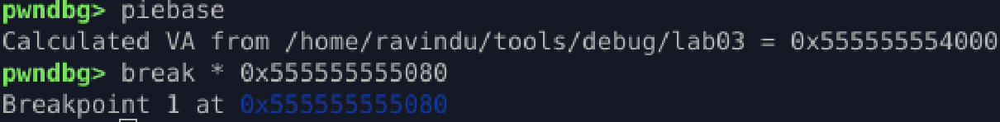
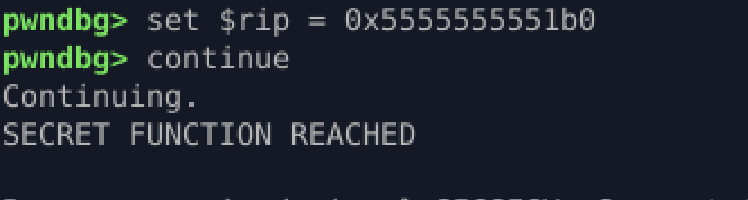

# Patch Control Flow

## Goal

Hijack control flow and force execution into hidden / unreachable code.

## Key Observations

* Address can be calculated as **PIE base + function offset**

  * `main` → `0x555555555080`
  * `hidden` → `0x5555555551b0`



## Action Taken

* Breakpoint set at `main` (`0x555555555080`)
* Instruction pointer overwritten to hidden function

  ```gdb
  set $rip = 0x5555555551b0
  ```

## Result

Control flow successfully hijacked.
Execution jumps directly into the hidden function and exits normally.



## Lessons

* Runtime control-flow manipulation
* Instruction-level execution thinking
* Practical difference between **call** and **jump**
