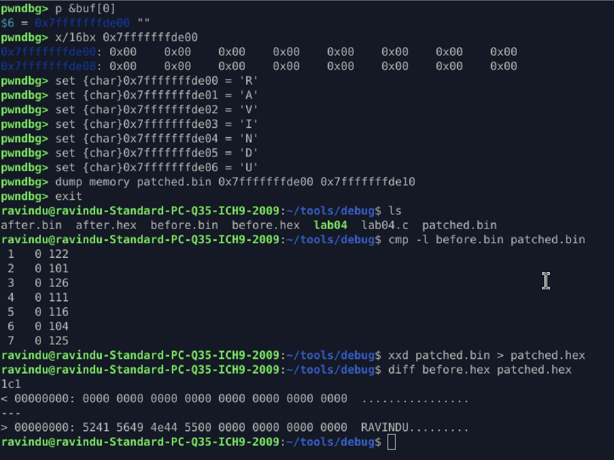

# Memory Analysis & Dumping

## Goal

Capture and compare memory snapshots to observe runtime changes.

## Key Observations

* `info proc` / `vmmap` shows virtual memory layout
* `r-xp` → executable code (`.text`)
* `rw-p` → writable memory (`.data`, heap, stack)
* `buf[]` resides on the **stack**
* `secret[]` resides in **.data**
* Accurate dumping requires correct memory boundaries

## Action Taken

* Capture initial snapshot

  ```gdb
  dump memory before.bin 0x7ffffffde00 0x7ffffffde10
  ```
* Set breakpoint after user input (`0x4011c`)
* Capture second snapshot

  ```gdb
  dump memory after.bin 0x7ffffffde00 0x7ffffffde10
  ```
* Compare snapshots

  ```bash
  cmp -l before.bin after.bin
  ```

## Result

Memory differences clearly observed after input.



## Lessons

* Memory is raw bytes, independent of representation
* Tools may display bytes as octal, hex, decimal, or ASCII
* Understanding representation changes is critical for reversing and exploitation