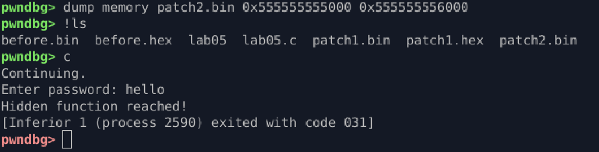

# Dynamic Memory & Patching

## Goal

Inspect runtime memory and manipulate execution using data + instruction patching.

## Target Program

* Stack buffer (`buf`)
* Control flag (`flag`)
* Hidden execution path (`hidden()`)

## Key Observations

* `vmmap` / `info proc mappings` reveal memory layout
* `buf` → stack
* `flag` → stack variable controlling execution
* Conditional branch gates access to `hidden()`
* Instructions and data are both patchable at runtime

## Actions Taken

### Memory Inspection

* Enumerated mappings (`vmmap`)
* Located variables (`info variables`)

### Runtime Control

* Conditional breakpoint on `main`
* Watchpoint on `flag` to observe state changes
* Real-time monitoring of memory writes

### Data Patching

* Forced execution by modifying control variable

  ```gdb
  set {int}flag = 1
  ```

### Instruction Patching

* Disassembled control flow
* Patched conditional jump → nop

  ```gdb
  set {unsigned char}ADDR = 0x90
  ```

### Memory Diffing

* Snapshot before execution
* Snapshot after patching
* Compared raw memory dumps to confirm changes

## Result

Execution redirected into `hidden()` without satisfying original condition.



## Lessons

* Watchpoints vs breakpoints for state tracking
* Data vs instruction patching tradeoffs
* Stack-driven control flow manipulation
* Safe exploit simulation using debugger + VM
* Memory diffing validates exploit impact

