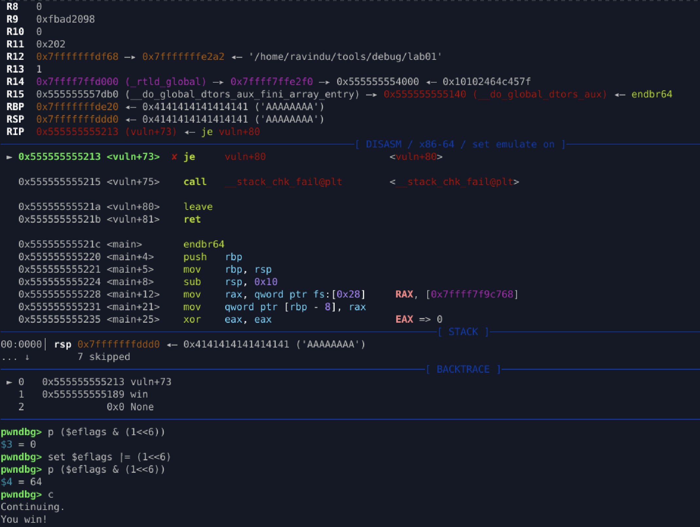

# Canary Bypass via Flag Manipulation (GDB)

## Goal

Bypass stack canary enforcement and redirect execution flow without knowing the canary value.

## Key Observation

* Stack canary protection relies on a conditional jump (`je`) after comparison
* Canary check logic:

  * `cmp canary, fs:0x28`
  * `je ok`
  * `call __stack_chk_fail`
* Conditional branch decision depends on **ZF**

## Action Taken

* Overwrote stack data beyond buffer (corrupting saved RBP and RIP)
* Manually forced Zero Flag (ZF = 1) before the canary check

  * Forced `je` to be taken
  * Skipped `__stack_chk_fail`
* Allowed execution to reach `leave; ret`

## Result

* Canary value was not validated
* Corrupted stack frame was accepted
* Control flow returned to attacker-controlled RIP (`win()`)

## Why 88 + RIP Worked

* Offset 88 marks the start of canary check region
* Canary enforcement was bypassed logically, not overwritten
* Saved RBP and RIP were already corrupted
* `ret` used attacker-controlled return address

## Lessons

* Stack canaries protect **control-flow logic**, not memory integrity
* Bypassing the check collapses the protection
* Flags are a valid attack surface under a debugger
* This technique is debugger-assisted and not applicable to real exploits

