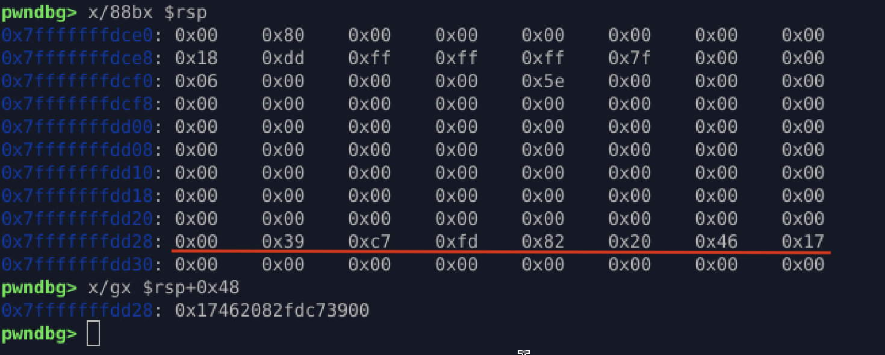

## Stack Canary Identification

### Canary Reference

* `__stack_chk_fail` is present in the binary
* Invoked on function epilogue when canary mismatch occurs

```
call sym.imp.__stack_chk_fail
```

---

### Canary Source

* Canary is loaded from **TLS**
* Accessed via **FS segment**

```
fs:[0x28]
```

---

### Stack Layout Observation

* Canary located at:

```
rsp + 0x48
```

* Distance from buffer start:

  * **72 bytes after `buf`**

---

### Canary Value Characteristics

* Canary is **8 bytes**
* Ends with `0x00`

Reason:

* Prevents leaking via string-based functions (`puts`, `printf`, `gets`)
* Acts as a string terminator to stop over-read

Example observed value:

```
0x17462082fdc73900
```

---

### Canary Identification Methods (GDB / pwndbg)

```gdb
x/gx $rsp+0x48              # View canary as 8-byte value
x/8bx $rsp+0x48             # View canary byte-by-byte
p/x *(long long*)($rsp+0x48)# Print canary as hex
x/gx $fs_base+0x28          # Read original TLS canary
```

---

### Conclusion

* Stack canary is present and active
* Overflow corrupts canary before RIP
* Execution aborts via `__stack_chk_fail` before `ret`

