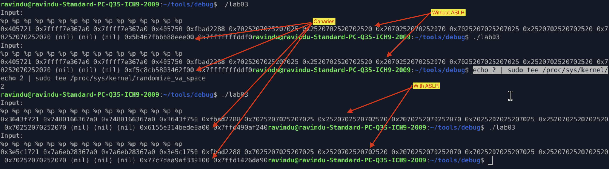

## Format String Canary Leak — Notes

### Canary Presence

* Stack protector enabled
* `__stack_chk_fail` referenced
* Canary loaded from `fs:[0x28]`

---

### Vulnerability Type

* Uncontrolled `printf(buf)`
* User input treated as format string
* Allows stack reads via `%p`, `%lx`

---

### Stack Canary Location

* Canary located after local buffer
* Confirmed via stack inspection

```
x/gx $rsp+OFFSET
```

---

### Leak Technique

* Use positional format specifiers
* Enumerate stack until 8-byte value ending in `00` appears

Example:

```
AAAA %p %p %p %p %p %p %p %p
```

or

```
%15$lx
```

---

### Canary Identification Criteria

* 8 bytes
* Ends with `00`
* Changes between executions
* Matches TLS value

---

### Verification

Compare leaked value with TLS canary:

```gdb
x/gx $fs_base+0x28
```

Leaked value == TLS canary ✔

---

### Conclusion

* Stack canary is readable via format string
* Protection relies on secrecy, not isolation
* Canary enforcement occurs only at function epilogue

