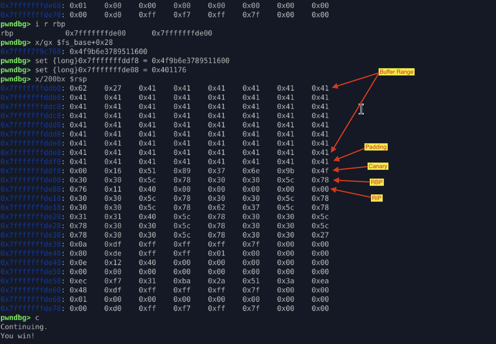

## Canary-Preserving Overflow — Notes

### Protection Observed

* Stack canary enabled
* Canary loaded from `fs:[0x28]`
* Enforced via conditional jump to `__stack_chk_fail`

---

### Canary Discovery

* Canary located after local buffer
* Ends with `00`
* Matches TLS canary value

---

### Exploit Strategy

* Do not overwrite canary
* Preserve canary value in payload
* Overwrite saved RIP after canary check passes

---

### Payload Logic

```
padding → canary → fake RBP → RIP
```

* Canary validation succeeds
* `leave; ret` executes normally
* Control flow redirected to `win()`

---

### Result

* Stack protection bypassed without disabling it
* Control flow hijacked legitimately
* Demonstrates real-world exploit structure
* Exploit demonstrated under debugger with runtime stack patching to validate canary-preserving control-flow hijack.
---

### Lesson

* Stack canaries protect integrity, not control flow
* If secrecy fails, protection collapses
* Canary-preserving exploits are required in real targets

