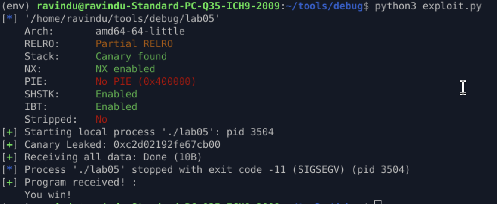

## Format String → Canary Leak → ret2win

### Protections

* Stack canary enabled
* Canary sourced from `fs:[0x28]`
* Enforced at function epilogue

---

### Vulnerabilities

* Uncontrolled format string (`printf(buf)`)
* Stack-based buffer overflow (`read`)

---

### Exploit Strategy

* Leak canary via format string
* Preserve exact canary value in payload
* Overwrite saved RIP after canary check passes

---

### Payload Layout

```
padding → canary → fake RBP → RIP
```

---

### Result

* Canary validation succeeds
* Stack frame accepted
* Execution redirected to `win()`

---

### Lesson

* Stack canaries rely on secrecy
* Information disclosure collapses protection
* Real exploits combine leak + preserve + hijack

