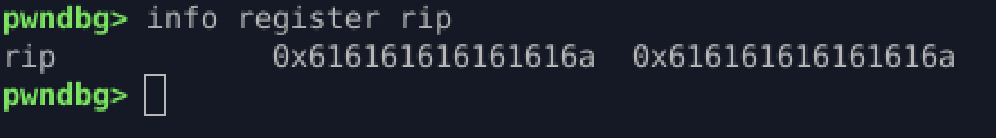

## NX Enabled → RIP Control Proof

### Protections

* NX enabled (non-executable stack)
* No PIE
* No stack canary
* Default System V AMD64 ABI

---

### Vulnerabilities

* Stack-based buffer overflow (`gets`)
* No bounds checking on user input

---

### Exploit Strategy

* Trigger stack overflow
* Overwrite saved RIP directly
* Prove instruction pointer control under NX
* No shellcode, no gadgets — crash-only validation

---

### Payload Layout

```
padding (64)
→ saved RBP (8)
→ RIP
```

---

### Observation

* NX does not prevent stack overwrite
* NX only blocks execution from stack memory
* Control-flow hijack still succeeds

---

### Result

* RIP overwritten with attacker-controlled value
* Crash occurs at controlled address
* Full control over execution flow confirmed

---

### Lesson

* NX is not an overflow mitigation
* Execution prevention ≠ control-flow protection
* Once RIP is controlled, ROP becomes mandatory


