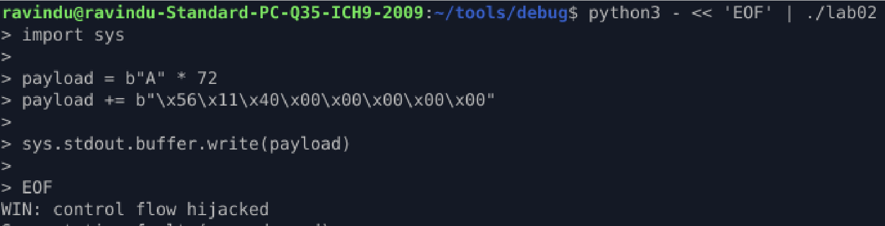

## NX Enabled → First ROP (ret2win)

### Protections

* NX enabled
* No PIE
* No stack canary
* Static code addresses

---

### Vulnerabilities

* Stack-based buffer overflow (`gets`)
* Direct overwrite of saved RIP

---

### Exploit Strategy

* Avoid stack execution (NX)
* Reuse existing code inside binary
* Redirect control flow to `win()` via return address overwrite
* No libc, no shellcode, no gadgets beyond `ret`

---

### Payload Layout

```
padding
→ saved RBP
→ win()
```

---

### Observation

* CPU executes trusted code segment
* NX restriction is irrelevant when jumping to `.text`
* Control transfer happens via standard function epilogue

---

### Result

* Stack unwinds normally
* Execution lands in `win()`
* NX fully bypassed without ROP chain complexity

---

### Lesson

* NX only blocks injected code
* ret2text is the simplest NX bypass
* ROP is just structured ret chaining


