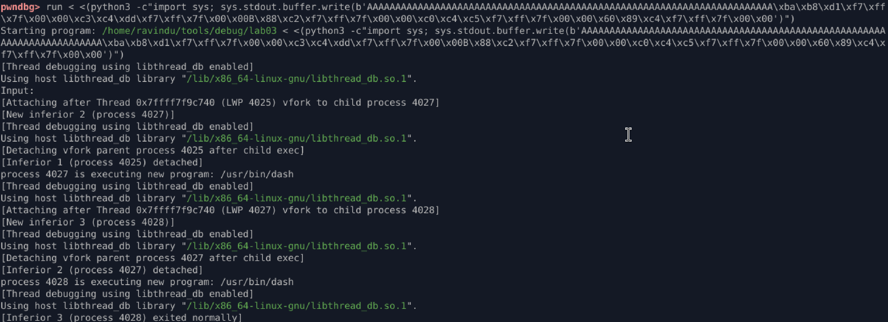

## NX Enabled → ret2libc (system)

### Protections

* NX enabled (non-executable stack)
* No PIE
* No stack canary
* ASLR enabled (libc randomized)

---

### Vulnerabilities

* Stack-based buffer overflow (`read`)
* Unbounded user-controlled input
* Saved RIP overwrite possible

---

### Exploit Strategy

* Avoid stack execution due to NX
* Reuse executable libc code
* Build ROP chain to call `system("/bin/sh")`
* Control function arguments via calling convention

---

### ROP Chain

```
padding
→ pop rdi ; ret
→ "/bin/sh"
→ ret
→ system
→ exit
```

---

### Observation

* NX blocks injected shellcode only
* libc remains executable and trusted
* Control-flow hijack + argument control equals code execution
* `/bin/sh` resolved to `/usr/bin/dash` via system()

---

### Result

* Control transferred into libc
* `system("/bin/sh")` executed successfully
* New process spawned (`dash`)
* NX bypass achieved without stack execution

---

### Lesson

* NX is a policy, not a barrier
* ROP converts returns into function calls
* ret2libc is the canonical NX bypass
* ASLR forces leaks for reliability


