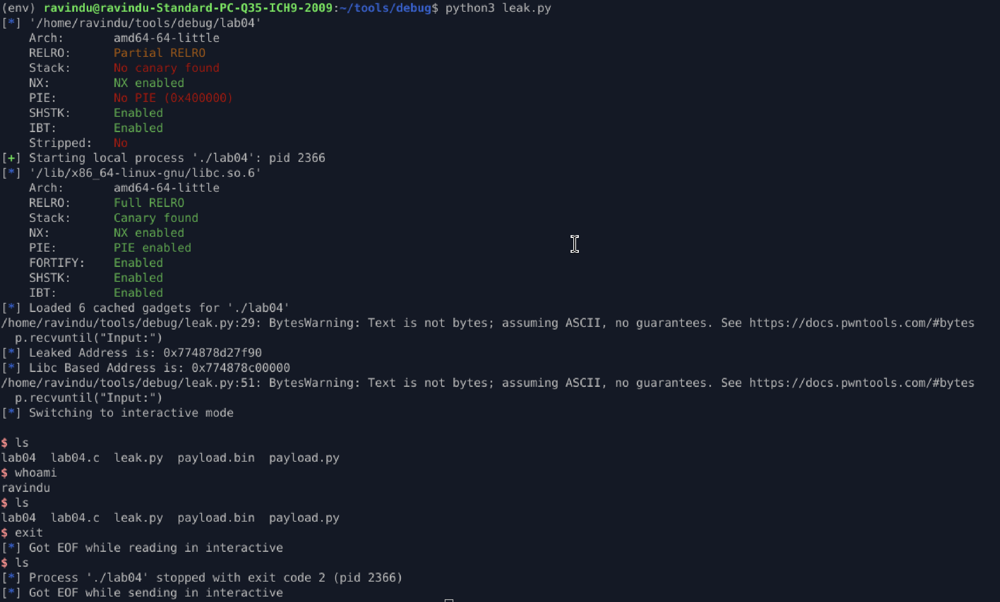

# ret2libc → Leak + Execute (ASLR-safe)

## Protections

* NX enabled (non-executable stack)
* No PIE (binary addresses static)
* No stack canary
* ASLR enabled (libc randomized)

---

## Vulnerabilities

* Stack-based buffer overflow (`read`)
* Unbounded write into fixed-size stack buffer
* Saved RIP overwrite possible

---

## Exploit Strategy

* NX blocks stack execution → reuse libc
* ASLR randomizes libc → leak required
* Leak libc address via GOT
* Calculate libc base at runtime
* Build second-stage ret2libc using resolved addresses

---

## Stage 1 — Information Leak

* Use `puts@plt` to print `read@got`
* Leak real runtime address of `read` in libc
* Return execution to `main` for second input

#### Stage 1 ROP Chain

```
padding
→ ret
→ pop rdi ; ret
→ puts@got
→ puts@plt
→ main
```

---

### Stage 2 — ret2libc Execution

* Compute libc base:

  ```
  libc_base = leaked_puts - puts_offset
  ```
* Resolve:

  * `system`
  * `"/bin/sh"`
  * `exit`
* Execute `system("/bin/sh")`

#### Stage 2 ROP Chain

```
padding
→ ret 
→ ret               (stack alignment)
→ pop rdi ; ret
→ "/bin/sh"
→ system
→ exit
```

---

### Observation

* GOT entries hold resolved libc addresses
* PLT acts as controlled call site
* Returning to `main` enables multi-stage exploitation
* NX is irrelevant once execution enters libc

---

### Result

* libc address leaked reliably
* libc base calculated at runtime
* `system("/bin/sh")` executed under ASLR
* NX + ASLR bypassed cleanly

---

### Lesson

* ASLR collapses under information disclosure
* ret2libc becomes reliable with leak discipline
* GOT + PLT are exploitation primitives, not just linker artifacts
* Real exploits are staged, not single-shot

```
leak → calculate → execute
```

