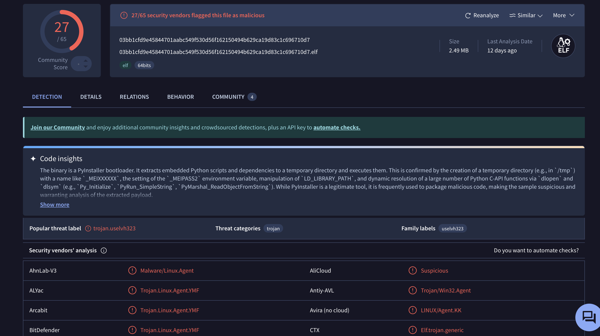

# Lab 01 — PyInstaller‑Packed Linux ELF Trojan

**Sample ID: USELVH323**

> ⚠️ **Warning**
> This repository contains analysis of **real malware samples**.
> **Do NOT execute binaries on your host system.**
> All analysis was performed in isolated virtual environments.

---

## Overview

This lab documents a **hands‑on reverse‑engineering analysis** of a real-world
**Linux x64 ELF Trojan** packed using **PyInstaller**.

The focus is on:

* Understanding the **loader and runtime behavior**
* Analyzing **path resolution and self‑identification logic**
* Practicing **static analysis, decompilation, and ABI reasoning**

This is a **learning-focused malware analysis lab**, not an academic report.

---

## Malware Summary

| Property        | Value                                         |
| --------------- | --------------------------------------------- |
| Platform        | Linux (x86_64)                                |
| File Type       | ELF                                           |
| Packing         | PyInstaller                                   |
| Classification  | Trojan                                        |
| Execution Model | Temp directory extraction + payload execution |

---

## Threat Intelligence

### Known Hashes

> Hashes are provided for **identification and research only**.

```
SHA256: 03bb1cfd9e45844701aabc549f530d56f162150494b629ca19d83c1c696710d7
SHA1  : f274603c9561f6695dbc90aae64bd081adc0a960
MD5   : ba9d7605c01400d84eeebf5d119ecec3
```

### VirusTotal Detection

> Sample is detected by multiple vendors as malicious.



*(Detection ratios and vendor names intentionally shown for verification, not endorsement.)*

---

## Analysis Environment

* OS: Linux (isolated VM)
* Tools:

  * `radare2`
  * `objdump`
  * `strings`
  * `gdb`
  * `pyinstxtractor`
* Network: **Disabled**
* Execution: **Never run on host**

---

## Analysis Scope

This repository focuses on **static and controlled dynamic analysis**, including:

* ELF entry‑point inspection
* PyInstaller unpacking behavior
* Argument (`argc / argv / envp`) handling
* Self‑path resolution (`argv[0]`)
* Basename extraction and reuse logic
* Function refactoring and semantic reconstruction

---

## Sub‑Labs

* **Lab 01.1 — Path Handling & Normalization Logic**

  * `argv[0]` resolution
  * `basename()` usage
  * Buffer handling and string propagation
  * Early indicators of persistence or relocation logic

*(Additional sub‑labs will be added as analysis progresses.)*

---

## Repository Structure

```
Lab_01_PyInstaller_ELF_Trojan/
├── README.md
├── functions/
│   ├── assets/
│   ├── fcn_copy_basename_to_buffer_(0x4031d0).md
│   ├── fcn_path_to_dirname_(0x403190).md
│   └── fcn_build_path(0x4031f0).md
├── iocs/
├── notes/
├── overview/
├── paths/
├── sample/
└── strings/
```

---

## Current Status

🟡 **Analysis in Progress**

* Core execution flow identified
* Key utility functions refactored
* Path and basename logic confirmed
* Further behavioral analysis ongoing

---

## Disclaimer

This repository is intended **strictly for educational and defensive security research**.

* No malware binaries are executed outside controlled environments
* No instructions are provided for malicious use
* All content is shared to improve **reverse‑engineering and threat analysis skills**

---

## Why this repo exists

This lab is part of a broader effort to:

* Build strong **Linux malware reversing fundamentals**
* Practice **real‑sample analysis**, not toy binaries
* Develop a clear, professional **analysis methodology**

---

## Author

**Ravindu Priyankara**\
Reverse Engineering & Malware Analysis\
(Portfolio Repository)

---
