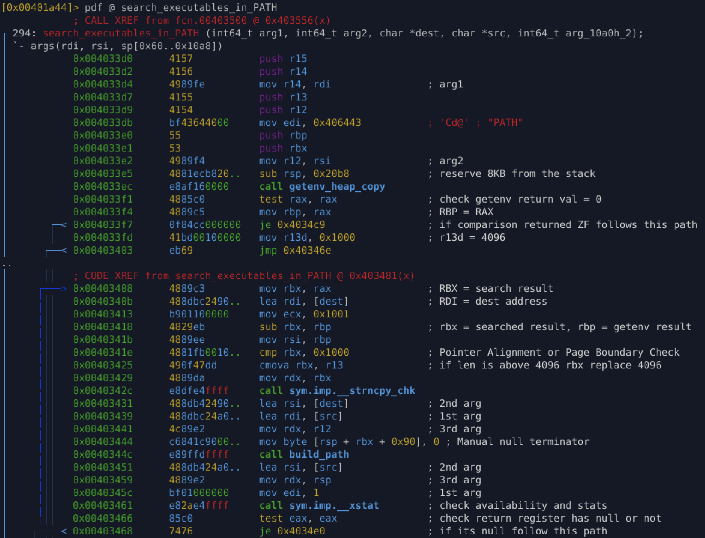
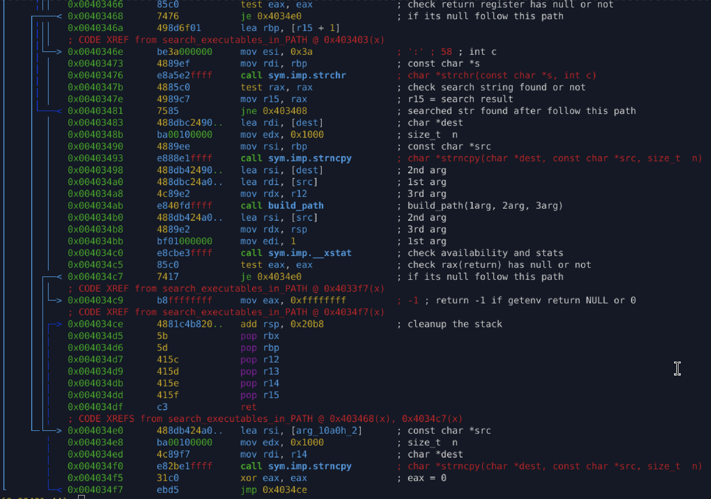

# `fcn_004033d0` – PATH-based executable resolution

## Purpose

Locate a valid executable path by iterating through the `PATH`
environment variable and testing constructed paths using filesystem checks.

## Behavior

* Retrieve `PATH` using a heap-safe getenv wrapper
* Split `PATH` entries by `':'`
* For each directory:

  * Construct `dir + '/' + filename`
  * Validate existence using `stat()`
* Return first valid resolved path

## Why Malware Uses This

* argv-based paths may be unreliable
* realpath may fail under sandboxing
* loaders may obscure execution location
* PATH search ensures resilience across environments

## Security Notes

* Avoids `strtok`
* Uses bounded copies
* Validates paths via filesystem, not strings
* Heap-backed environment strings prevent lifetime issues

---

## Appendix

