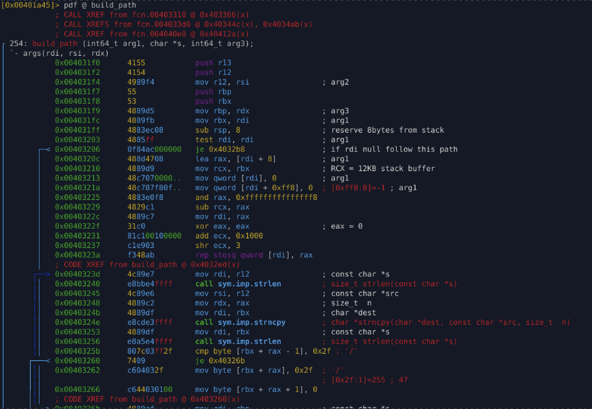
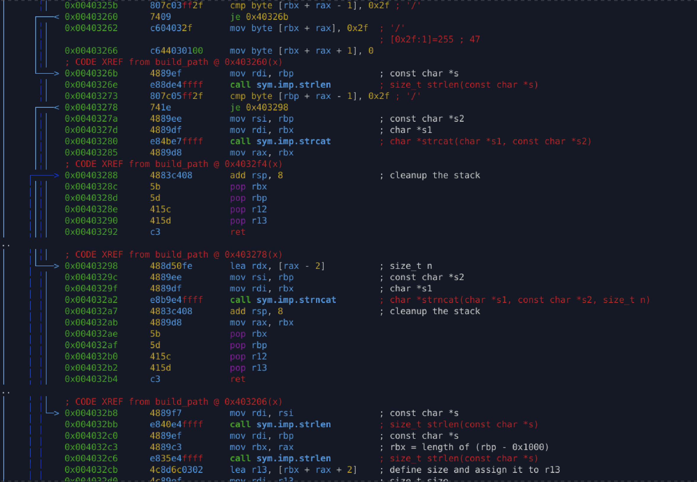
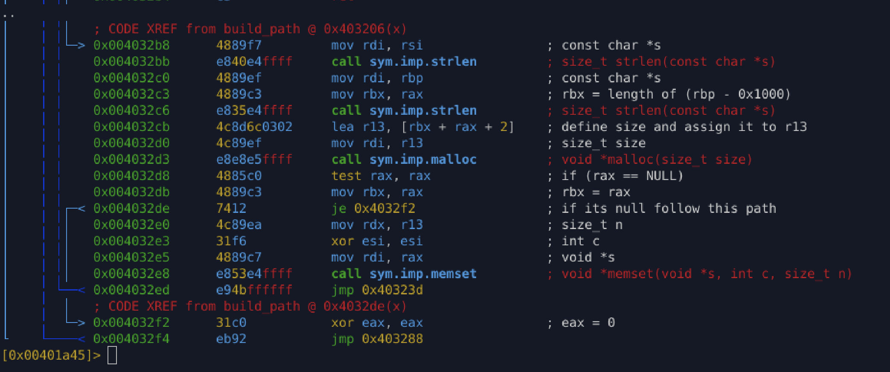

# `build_path` (`0x4031f0`)

## Purpose

Construct a filesystem path by combining a base path and a secondary path component.
Supports both **caller-provided buffers** and **heap-allocated output**.

---

## Inputs

* **`rdi`** → Destination buffer (optional, may be `NULL`)
* **`rsi`** → Base path string
* **`rdx`** → Path component to append

---

## Behavior

### Mode 1 — Destination buffer provided

If `rdi != NULL`:

1. Clears and aligns the destination buffer.
2. Copies the base path into it.
3. Ensures a trailing `/`.
4. Appends the second path component.
5. Returns the destination buffer.

---

### Mode 2 — Destination buffer is `NULL`

If `rdi == NULL`:

1. Calculates required size:

   * `strlen(base) + strlen(append) + 2`
2. Allocates memory using `malloc`.
3. Zeroes the allocated buffer.
4. Builds the path using the same logic as Mode 1.
5. Returns a heap-allocated path string.

---

## Reconstructed C Code

```c
char *build_path(char *dst, const char *base, const char *append) {
    char *buf = dst;

    if (!buf) {
        size_t size = strlen(base) + strlen(append) + 2;
        buf = malloc(size);
        if (!buf) return NULL;
        memset(buf, 0, size);
    }

    strncpy(buf, base, strlen(base));

    if (buf[strlen(buf) - 1] != '/')
        strcat(buf, "/");

    if (append[strlen(append) - 1] == '/')
        strncat(buf, append, strlen(append) - 1);
    else
        strcat(buf, append);

    return buf;
}
```

---

## Analysis Notes

### Why malware uses this pattern

* Dynamic construction of:

  * Drop paths
  * Persistence paths
  * Temporary directories
  * Payload locations
* Avoids hard-coded paths
* Supports flexible reuse across stack and heap contexts
* Makes static detection harder


This function acts as a **core path-building primitive** used across:

* Loader logic
* Payload staging
* File system interaction

It complements:

* `copy_basename_to_buffer`
* `path_to_dirname`

Together, these form a **complete self-path resolution system**.

## Appendix








---
