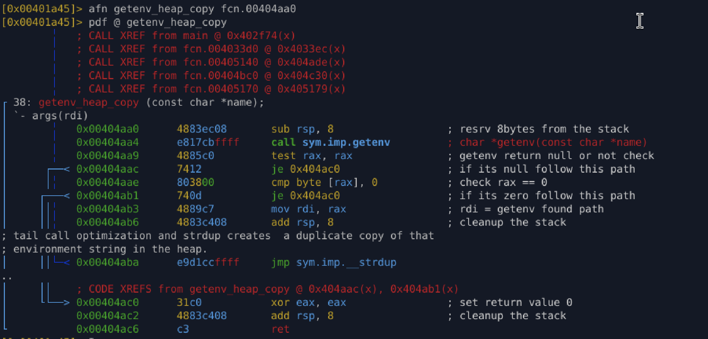

## `getenv heap copy` (0x00404aa0)

### Purpose

Retrieve an environment variable **and duplicate it onto the heap** only if it
exists and is non-empty.

This prevents:

* stack lifetime issues
* environment mutation side-effects
* pointer invalidation

---

### Inputs

* **rdi** – Environment variable name (`"HOME"`, `"TMPDIR"`, `"PWD"`, etc.)

---

### Behavior

1. Call `getenv(name)`
2. If return is `NULL` → return `NULL`
3. If string is empty → return `NULL`
4. Otherwise:

   * duplicate string using `strdup`
   * return heap-backed pointer

---

### Assembly Logic Breakdown

```asm
call getenv
test rax, rax        ; NULL?
je   fail

cmp  byte [rax], 0   ; empty string?
je   fail

jmp  strdup          ; tail-call optimization
```

This is **deliberately tight and defensive**.

---

### Reconstructed C (Accurate)

```c
char *safe_getenv_dup(const char *name) {
    char *val = getenv(name);

    if (!val || *val == '\0')
        return NULL;

    return strdup(val);
}
```

✔ Tail-call optimized\
✔ Heap-stable\
✔ Malware-safe

---

## Why Malware Uses This Pattern

This function exists for **fallback path logic**, which connects directly to what we observed earlier.

### When This Gets Used

* `argv[0]` path is:

  * malformed
  * relative
  * symlinked
  * sandboxed
* Executable launched from:

  * `/proc/self/exe`
  * loader stubs
  * temp extract paths

### Typical Env Vars Used

* `PWD`
* `HOME`
* `TMPDIR`
* `XDG_RUNTIME_DIR`

---

## Appendix 

