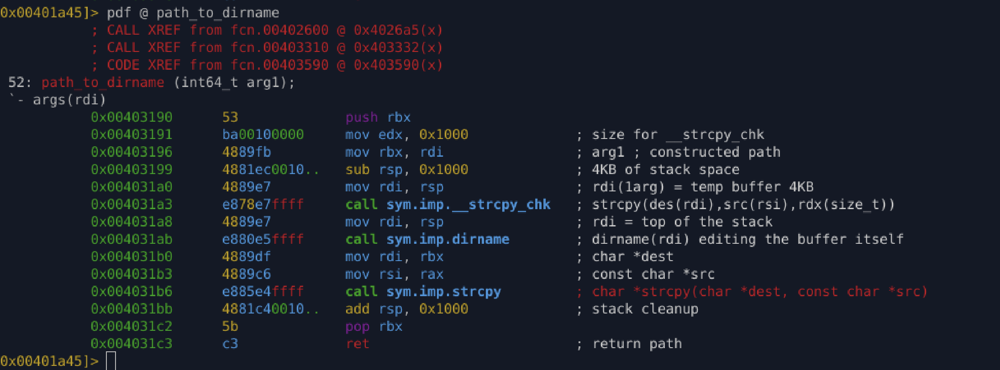

# `path_to_dirname` (`0x403190`)

## Purpose

Extract the directory component from a full filesystem path and store it in a caller-provided buffer.

---

## Inputs

* **`rdi`** → Destination buffer
* **`rsi`** → Source path string (e.g. resolved executable path)

---

## Behavior

1. Allocates a 4KB temporary buffer on the stack.
2. Copies the source path into the temporary buffer using `__strcpy_chk`.
3. Calls `dirname()` to extract the directory path (in-place modification).
4. Copies the resulting directory path into the destination buffer.

---

## Reconstructed C Code

```c
void path_to_dirname(char *dest, const char *path) {
    char tmp[4096];

    strcpy(tmp, path);
    strcpy(dest, dirname(tmp));
}
```

---

## Output

* The directory portion of the input path is written to the destination buffer.

---

## Analysis Notes

### Why malware performs this operation

Extracting the executable’s directory is commonly used to:

* Locate adjacent payloads or configuration files
* Determine installation or execution directory
* Build persistence paths
* Reconstruct full paths using:

  * `dirname(path)` + `basename(path)`
* Avoid reliance on hard-coded locations

---

### Implementation details

* `dirname()` modifies its input buffer, requiring a temporary copy.
* Use of `__strcpy_chk` indicates compilation with stack-protection / `_FORTIFY_SOURCE`.
* The function avoids modifying the original path argument directly.

---

## Appendix



---

