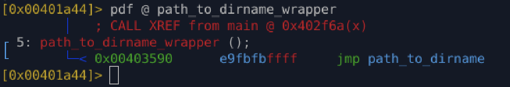

# `fcn_path_to_dirname_wrapper` (`0x403590`)

## Purpose

Thin **wrapper / alias function** that directly forwards execution to
`path_to_dirname`.

---

## Inputs

* Inherits arguments from caller
* Registers are passed **unchanged** to `path_to_dirname`

---

## Behavior

1. Performs an **unconditional jump** (`jmp`) to `path_to_dirname`
2. No stack setup
3. No local logic
4. No return handling of its own

This function exists purely as a **control-flow redirection point**.

---

## Disassembly

```asm
fcn.00403590:
    jmp path_to_dirname
```

---

## Reconstructed C Code

```c
void path_to_dirname_wrapper(...) {
    path_to_dirname(...);
}
```

*(Exact prototype depends on the original `path_to_dirname` signature.)*

---

## Output

* Whatever `path_to_dirname` returns
* This function adds **no transformation** or validation

---

## Analysis Notes

### Why malware authors do this

Wrapper jump functions like this are commonly used to:

* Obfuscate call graphs
* Inflate the number of functions to confuse static analysis
* Create stable call sites for:

  * Patching
  * Hooking
  * Future updates
* Break simple signature-based detection
* Complicate automated decompilers (extra symbols, extra edges)

In real malware, these wrappers are often auto-generated by:

* Custom compilers
* Packers
* Obfuscation frameworks
* Hand-rolled build systems

---


## Appendix

