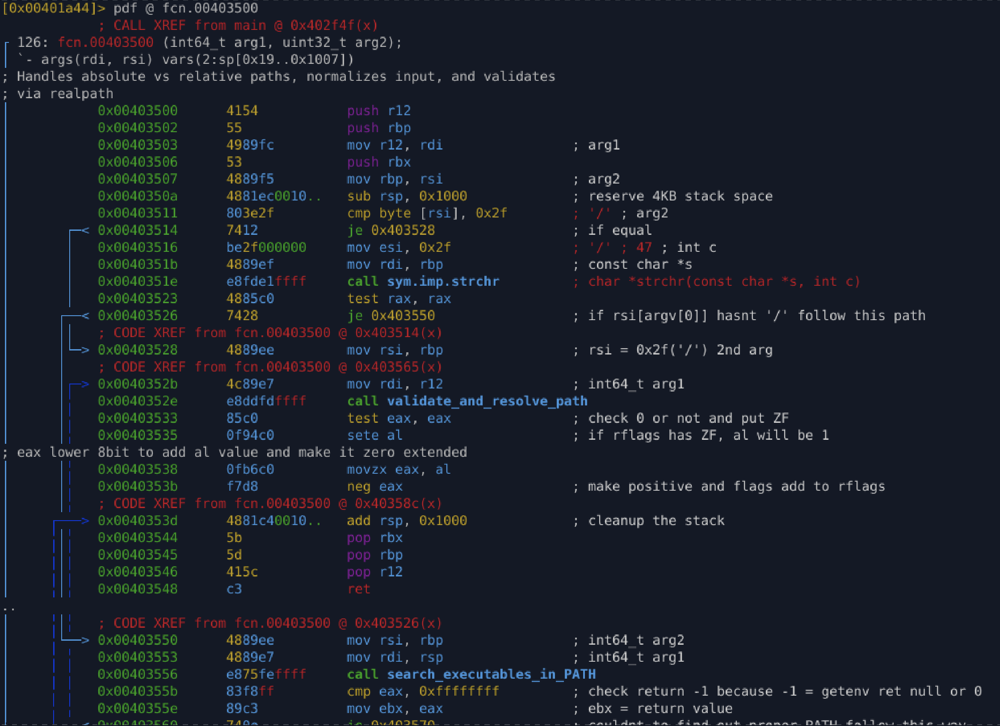
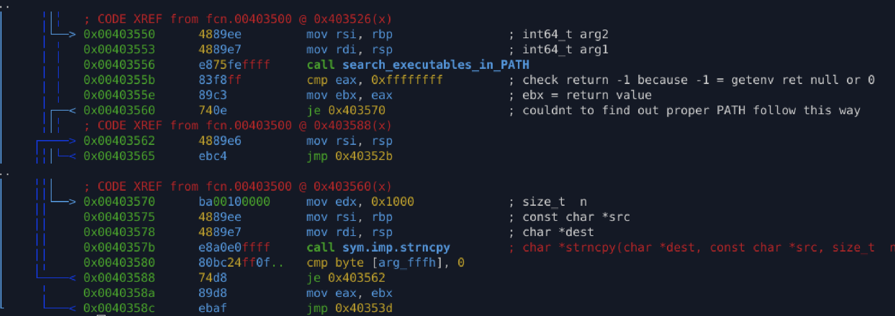

# `fcn_resolve_and_validate_path` (`0x403500`)

## Purpose

Resolve a user-supplied executable path into a **validated absolute path**, handling:

* absolute paths
* relative paths containing directory separators
* `$PATH`-based executable lookup

The function normalizes the result and validates it before use.

---

## Inputs

* **`rdi`** → Context / destination structure (passed to validation routine)
* **`rsi`** → Path string (typically from `argv[]`)

---

## Behavior

1. Allocates a **4 KB temporary buffer** on the stack for path construction.
2. Checks whether the input path begins with `'/'` (absolute path).
3. If not absolute:

   * Searches for `'/'` inside the string to distinguish:

     * simple command names (`ls`)
     * relative paths (`./tool`, `bin/tool`)
4. For simple command names:

   * Searches executable locations defined in the `$PATH` environment variable.
   * Writes the resolved path into the temporary stack buffer.
5. If `$PATH` lookup fails:

   * Falls back to copying the original string into the buffer.
6. Passes the resolved path to an internal validation routine that:

   * Normalizes the path (realpath-like behavior)
   * Performs existence and safety checks
7. Returns a **UNIX-style status code** (`0` on success, `-1` on failure).

---

## Reconstructed C Code

```c
int resolve_and_validate_path(void *ctx, const char *path) {
    char tmp[4096];

    if (path[0] == '/' || strchr(path, '/')) {
        return validate_and_resolve_path(ctx, path) ? -1 : 0;
    }

    int r = search_executables_in_PATH(tmp, path);
    if (r != -1) {
        return validate_and_resolve_path(ctx, tmp) ? -1 : 0;
    }

    strncpy(tmp, path, sizeof(tmp));
    return validate_and_resolve_path(ctx, tmp) ? -1 : 0;
}
```

---

## Output

* Returns `0` on successful path resolution and validation.
* Returns `-1` if the path cannot be resolved or fails validation checks.

---

## Analysis Notes

### Why malware commonly performs this operation

Executable path resolution is a critical precursor to:

* Executing secondary payloads reliably
* Locating dropped components across environments
* Ensuring consistent behavior regardless of launch context
* Avoiding execution failures caused by relative paths
* Defeating naive sandboxing environments with unusual `$PATH` layouts
* Validating execution from expected directories (anti-analysis logic)

---

### Stack-allocated path buffer (`0x1000` bytes)

* The function reserves **4 KB** on the stack explicitly for path handling.
* This size aligns with typical `PATH_MAX` usage.
* Avoids heap allocation to reduce observable artifacts and complexity.
* Common in malware prioritizing stealth and simplicity.

---

### Return value construction

The function converts boolean validation results into canonical UNIX error codes:

```asm
sete al
movzx eax, al
neg eax
```

Resulting in:

| Condition | Return |
| --------- | ------ |
| Success   | `0`    |
| Failure   | `-1`   |

This design integrates cleanly with surrounding control flow.

---

## Appendix






---