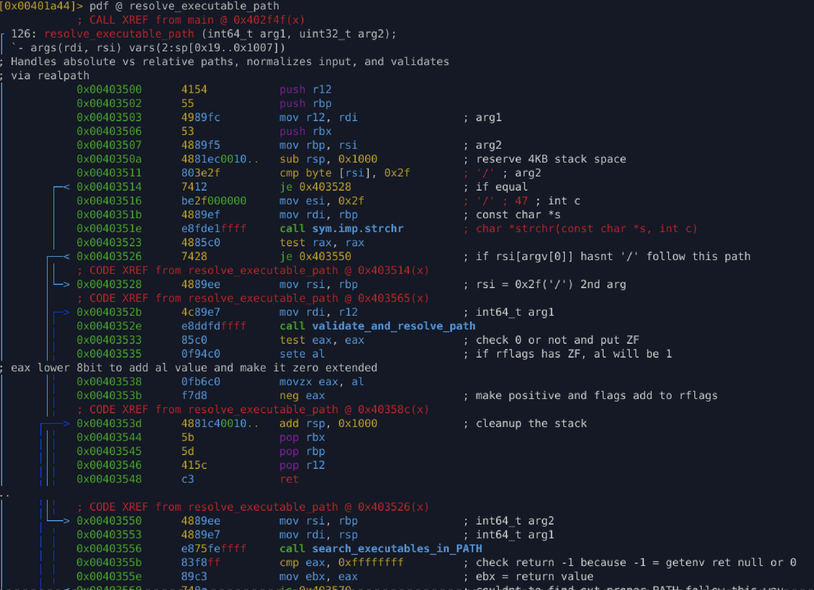
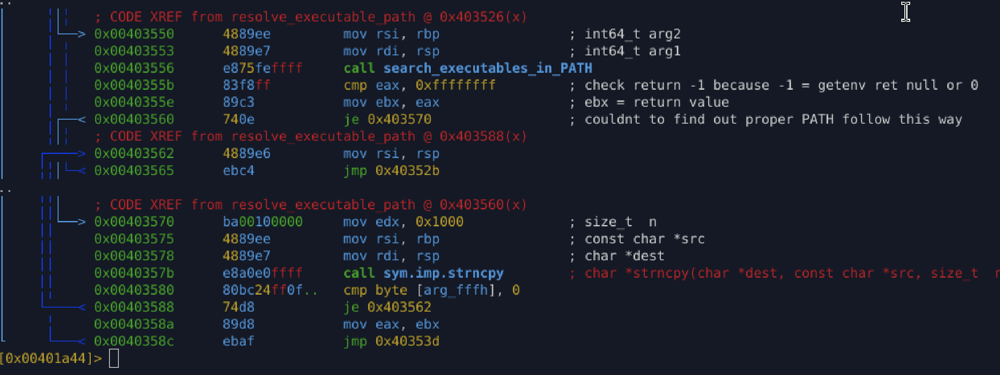

# `fcn_resolve_executable_path` (`0x403500`)

## Purpose

Resolve an executable path provided via `argv[0]` into a **validated, normalized absolute path**, handling:

* absolute paths
* relative paths
* `$PATH` lookups

This function acts as the **central path-resolution orchestrator** for the malware.

---

## Inputs

* **`rdi`** → Context / destination structure used by validation logic
* **`rsi`** → Path string (typically `argv[0]`)

---

## High-Level Behavior

1. Allocates a **4 KB stack buffer** for temporary path construction.
2. Determines whether the input path is:

   * absolute (`/bin/tool`)
   * relative with slashes (`./tool`, `bin/tool`)
   * bare command name (`tool`)
3. Resolves the path using one of three strategies:

   * direct validation
   * `$PATH` search
   * fallback copy
4. Normalizes and validates the final path.
5. Returns a UNIX-style success or failure code.

---

## Detailed Control Flow

### 1. Absolute Path Check

```asm
cmp byte [rsi], '/'
je  absolute_or_relative_with_slash
```

If the path begins with `/`, it is treated as an absolute path and sent directly for validation.

---

### 2. Relative Path Detection

```asm
strchr(path, '/')
```

If the string contains `/` anywhere, it is treated as a relative path and validated as-is.

---

### 3. `$PATH` Lookup for Bare Executables

If no `/` is present:

1. Searches directories listed in `$PATH`
2. Writes the resolved executable path into the stack buffer
3. If lookup fails, falls back to copying the original string

---

### 4. Validation & Normalization

All resolved paths are passed to:

```
validate_and_resolve_path()
```

Which likely performs:

* canonicalization (`realpath`-style)
* existence checks
* permission checks
* environment consistency checks

---

## Reconstructed C Code

```c
int resolve_executable_path(void *ctx, const char *path) {
    char tmp[4096];

    if (path[0] == '/' || strchr(path, '/')) {
        return validate_and_resolve_path(ctx, path) ? -1 : 0;
    }

    int r = search_executables_in_PATH(tmp, path);
    if (r != -1) {
        return validate_and_resolve_path(ctx, tmp) ? -1 : 0;
    }

    strncpy(tmp, path, sizeof(tmp));
    return validate_and_resolve_path(ctx, tmp) ? -1 : 0;
}
```

---

## Output

| Condition                       | Return |
| ------------------------------- | ------ |
| Path resolved & validated       | `0`    |
| Resolution or validation failed | `-1`   |

---

## Relationship to Other Functions

This function **coordinates** multiple lower-level helpers:

```
main()
 └─ fcn_resolve_executable_path (0x403500)
     ├─ search_executables_in_PATH
     │   └─ getenv(PATH)
     ├─ copy_basename_to_buffer
     ├─ path_to_dirname
     ├─ build_path
     └─ validate_and_resolve_path
```

It is the **decision point** that selects which resolution strategy is used.

---

## Analysis Notes

### Why malware invests heavily in path resolution

This logic enables malware to:

* execute reliably across environments
* survive different launch contexts
* avoid failures in sandboxed systems
* resolve self-location accurately
* build secondary payload paths
* validate execution from expected directories

Path resolution is a **pre-execution trust gate**.

---

### Stack-based path handling

* Uses a fixed **4 KB stack buffer**
* Avoids heap allocation (stealth + simplicity)
* Matches `PATH_MAX` conventions
* Reduces observable memory artifacts

---

### Return-value normalization trick

```asm
sete al
movzx eax, al
neg eax
```

Converts boolean success into:

* `0` → success
* `-1` → failure

Classic UNIX-style error propagation.

---

## Appendix





