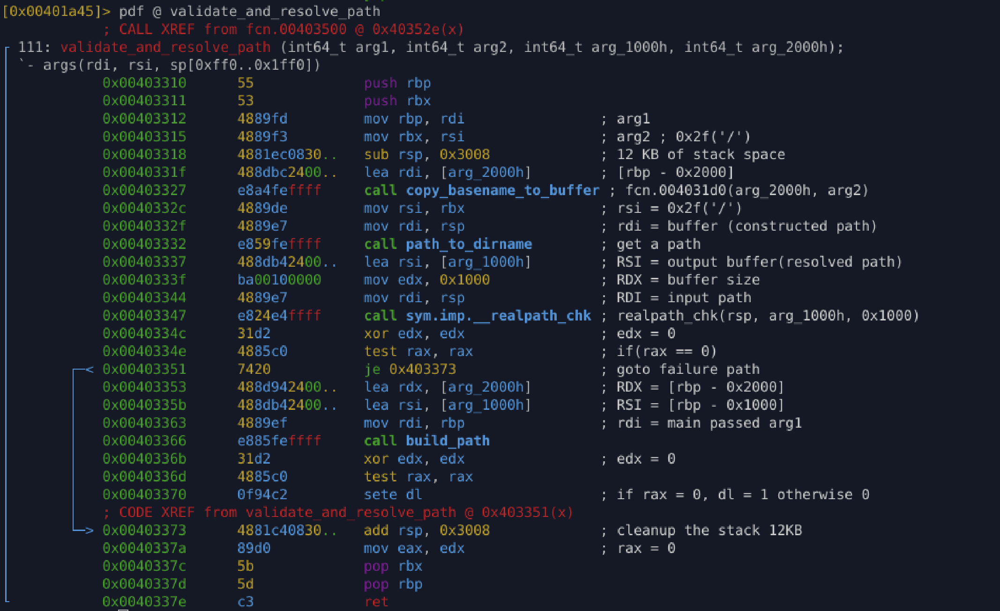

# `validate_and_resolve_path` (0x00403310)

### Purpose

Safely **normalize, validate, and reconstruct an executable path** by combining
a canonical directory path with the executable’s basename.

This function acts as a **path validation gate** before further execution.

---

### Inputs

* **rdi (arg1)** – Destination buffer / context pointer for final path
* **rsi (arg2)** – Path separator reference (`'/'`)
* **Stack buffers**

  * `[rbp-0x2000]` – Basename buffer
  * `[rbp-0x1000]` – Canonical resolved path
  * `rsp`          – Temporary working path buffer

---

### Behavior (Step-by-Step)

1. **Extract executable basename**

   * Calls `copy_basename_to_buffer`
   * Stores basename of the current executable into a local buffer

2. **Convert path to directory**

   * Calls `path_to_dirname`
   * Strips filename and keeps directory portion only

3. **Resolve canonical filesystem path**

   * Calls `__realpath_chk`
   * Removes symlinks, `../`, and ensures absolute path
   * Failure here aborts the routine

4. **Rebuild final path**

   * Calls `build_path`
   * Combines:

     * canonical directory path
     * extracted basename
   * Produces a normalized, deterministic executable path

5. **Return status**

   * Returns `0` on success
   * Returns `1` on failure

---

### Return Value

| Value | Meaning |
| ----: | ------- |
|   `0` | Success |
|   `1` | Failure |

> Note: Return logic is intentionally inverted (common in malware control paths).

---

### Reconstructed Pseudocode (Behavior-Accurate)

```c
int validate_and_resolve_path(char *out_path, const char *sep) {
    char basename_buf[0x2000];
    char resolved_path[0x1000];
    char temp_path[0x1000];

    copy_basename_to_buffer(basename_buf, sep);
    path_to_dirname(temp_path);

    if (realpath(temp_path, resolved_path) == NULL) {
        return 1;
    }

    if (build_path(out_path, resolved_path, basename_buf) == 0) {
        return 1;
    }

    return 0;
}
```

---

### Why Malware Uses This Pattern

* Ensures **deterministic execution paths**
* Defeats:

  * symlink tricks
  * relative path execution
  * sandbox path inconsistencies
* Prepares stable paths for:

  * self-copying
  * persistence setup
  * payload dropping
  * execution relaunch

---

### Analyst Notes

* Heavy stack usage (≈12 KB) suggests **path manipulation isolation**
* Use of `realpath` indicates **anti-evasion and path sanitization**
* Modular design shows **deliberate engineering**, not commodity malware

---

### Related Functions

* `copy_basename_to_buffer` (0x4031d0)
* `path_to_dirname` (0x403190)
* `build_path` (0x4031f0)

---

## Appendix



