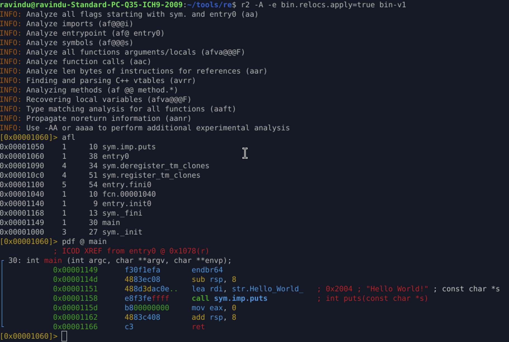

# **Hello World — L2-V1 Reverse Engineering Report**

## **0. Challenge Metadata**

* **Binary:** `bin-v1`
* **Version:** v1
* **Protection Level:** L1 (O1 optimization)
* **Compile Flags:**

  ```bash
  gcc -o bin-v1 hello.c -O1
  ```
* **Goal:** Analyze GCC Level-1 optimization effects on a simple ELF binary.

---

## **1. Static Analysis (radare2)**

Run:

```bash
r2 -A -e bin.relocs.apply=true bin-v1
```



### **Key Observations**

* Frame pointers removed
* Compiler uses **minimal stack reservation**
* Simple assignments are **inlined**
* Control flow is more compact compared to `-O0`

---

## **2. Assembly Breakdown**

```asm
0x114d  sub rsp, 8                    ; reserve 8 bytes
0x1151  lea rdi, str.Hello_World_     ; load string → RDI (1st arg)
0x1158  call sym.imp.puts             ; puts("Hello World")
0x115d  mov eax, 0                    ; return value
0x1162  add rsp, 8                    ; restore stack
0x1166  ret                           ; exit
```

### **Why this matters**

* `-O1` removes unnecessary prologue/epilogue
* Only allocates **exact space needed**
* Direct `lea` → no temporary variables
* Very typical compiler pattern for tiny functions

---

## **3. Debugging with GDB**

Commands:

```bash
gdb -q bin-v1
break *0x555555555158
run
info registers rdi
x/s 0x555555556004
disassemble /r main
```

### **Findings**

* `main` located at: `0x555555555149`
* String lives at: `0x555555556004`
* Before `puts`:

  * `rdi = 0x555555556004` (correct AMD64 ABI first argument)
* PLT resolves → `puts()` executes → returns 0


---

## **4. Summary**

Optimized binary characteristics:

* No traditional stack frame (`rbp` untouched)
* Uses **8-byte stack reservation** only for ABI alignment
* Arguments are passed directly using registers
* Minimal instruction count
* Clean, compact, compiler-optimized flow

This binary is a great starting point for recognizing **O1 optimization patterns** in real reverse engineering.

---

## **5. What I Learned**

* How GCC `-O1` transforms simple functions
* How stack frames get replaced with minimal stack usage
* How compilers inline simple operations
* How optimized functions look in both r2 and GDB

---

## **6. Next Steps**

* Reverse the same program with:

  * `-O2`, `-O3`, `-Os`
  * PIE vs no-PIE
  * strip / no symbols
  * RELRO variations
* Document the patterns in each variant

---