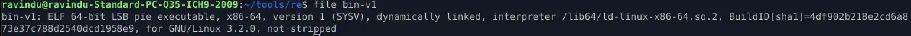
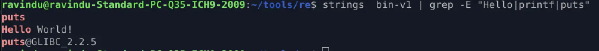

# **Hello World Program — Reverse Engineering Report**

## **0. Challenge Metadata**

* **Binary name:** `bin-v1`
* **Version:** v1
* **Protection level:** L0 (baseline)
* **Compile flags:** `gcc -o bin-v1 hello.c`
* **Goal:** Understand program flow, imports, and the `puts` call.

---

## **1. Quick Triage**

### **Basic Information**

#### `file bin-v1`



#### `checksec --file=bin-v1`


#### `strings bin-v1 | grep -E "Hello|printf|puts"`



**Observations:**

* Dynamically linked (uses libc)
* Not stripped → symbols preserved
* Contains “Hello, world!” literal

---

### **Dynamic Tracing**

#### `ltrace ./bin-v1`


**Result:** Calls `puts("Hello, world!")` once, then exits.

#### `strace -e trace=write ./bin-v1`


---

### **Symbol Lookup**

#### `nm -C bin-v1`


**Observation:** `main` found at `0x1149`.

---

### **Static Analysis (radare2)**

#### `r2 -A -e bin.relocs.apply=true bin-v1`


**Notes:**

* `main` loads the string address into `rdi`
* Calls `sym.imp.puts` via PLT
* Simple, linear execution flow

---

## **2. Control-Flow Summary**

High-level pseudocode:

```c
int main() {
    puts("Hello, world!");
    return 0;
}
```

Execution flow:

1. Set up stack frame
2. Load string address into `rax`
3. Move it into `rdi` (first argument — SysV AMD64 ABI)
4. Call `puts`
5. Return 0

---

## **3. Assembly Deep Dive**

```asm
0x114d: push rbp
0x114e: mov rbp, rsp        ; function prologue

0x1151: lea rax, str.Hello_World_  ; load string address
0x1158: mov rdi, rax         ; argument for puts
0x115b: call sym.imp.puts    ; call via PLT

0x1160: mov eax, 0           ; return value

0x1165: pop rbp
0x1166: ret                  ; function epilogue
```

---

## **4. Debugging with GDB**

### **Commands Used**

```bash
gdb -q bin-v1
break *0x55555555515b
run
info registers rdi
x/s 0x555555556004
disassemble /r main
```

### **Findings**

* `main` at: `0x555555555151`
* String at: `0x555555556004`
* Before `puts` call,

  * `rdi = 0x555555556004` (correct argument)
* After PLT call → returns 0


---

## **5. Summary of Behavior**

`bin-v1` is a minimal ELF x86-64 dynamically linked binary that prints `"Hello, world!\n"` using libc’s `puts`.

Key characteristics:

* Uses PLT/GOT for dynamic linking
* Symbols are present (not stripped)
* Compiler optimized `printf("Hello")` → `puts("Hello")` because no formatting is needed
* No branching, no user input, no exploitable conditions

Great baseline example for understanding:

* PLT/GOT mechanics
* Simple control flow
* RIP-relative addressing
* Basic runtime traces (ltrace, strace)

---

## **6. What I Learned / TODO**

### **Learned**

* How `lea rax, [rip+...]` resolves static string addresses
* Difference between static disassembly vs dynamic traces
* Function resolution via PLT/GOT

### **TODO**

* Recompile with security flags (PIE, RELRO, Canary) and analyze differences
* Produce a stripped version and test symbol recovery

---

## **7. Quick Commands (Cheat Sheet)**

```bash
file bin-v1
checksec --file=bin-v1
strings bin-v1
nm -C bin-v1
objdump -d -M intel bin-v1 | sed -n '1,140p'
r2 -A -e bin.relocs.apply=true bin-v1
gdb -q bin-v1
ltrace ./bin-v1
strace -e write ./bin-v1
```

---