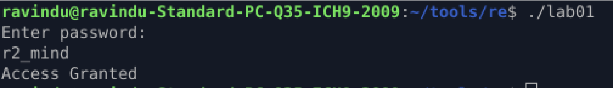

# Password Check (Static + Debug Reversing)

## Objective

Reverse the control flow of a password-protected binary and identify how input is validated using radare2.

## Binary Info

* File: lab01
* Arch: amd64
* RELRO: Partial
* Canary: No
* NX: Enabled
* PIE: No
* Stripped: No

## Initial Recon

1. functions
    * main = 0x4011c9
    * check = 0x401196

* Inside the main function used `fgets` for get input.
* Inside the check function `strcmp` is used, meaning return value will be tested (0 = equal).

## Control Flow Analyse

* Get a input via fgets.
* Pass the input to check function.
* Inside the check function compare it using `strcmp`.
* Return value is tested:
    * 0  -> Success path
    * !=0 -> Failure path

```
display "Enter password"
↓
check(input)
↓
strcmp
↓
je  success
jne failure
```

## Debugging and Tracing

Mainly monitored these registers and found these things
* rdi = input stored (amd64 ABI 1st arg)
* rsi = hardcoded password stored (amd64 ABI 2nd arg)
* rax = after string comparison return value hold (most of the time rax hold return value)

## Key Discovery

The correct password is stored in memory as a static char array passed directly to strcmp.

## Final Result

Input: r2_mind
Output: Access Granted



## Lesson Learned

* strcmp returns 0 on equality
* Conditional jumps rely entirely on return values
* Debugging reveals truth faster than static guessing

## r2 Commands Used

* aaa
* iI
* afl
* pdf @ main
* pdf @ sym.check
* db 0xaddress
* db
* ds
* pd 4
* ? eax
* dr eax = 0
* dc
* ood
* dr rdi=rsi

(Note: register modification was used experimentally, not required for solving)

## Notes
This binary is non-PIE and unstripped, making it suitable for beginner control-flow analysis.