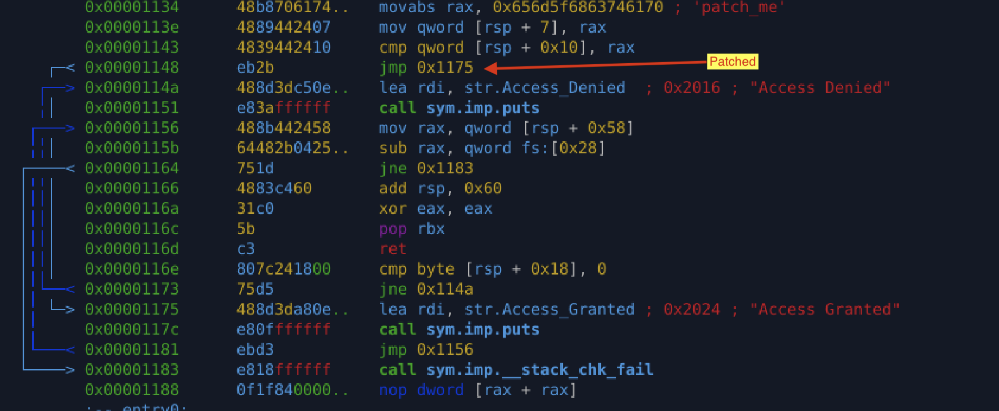

# Password Check Bypass (Optimized Binary + Static Patching)

## Objective

Analyze an **O3-optimized password check binary** and bypass authentication by **patching control flow** using radare2.

Focus is on:

* Compiler optimizations
* Inlined comparisons
* Conditional jump manipulation

---

## Binary Info

* File: lab02
* Arch: amd64
* RELRO: partial
* Canary: Yes
* NX: enabled
* PIE: No
* Stripped: No
* Optimization: `-O3`

---

## Initial Recon

* No separate `check()` function (inlined by compiler)
* Password comparison implemented directly in `main`
* Uses stack canary protection
* No `strcmp` — replaced with direct memory comparison

---

## Control Flow Analysis

High-level logic reconstructed from disassembly:

```
print "Enter password"
↓
fgets(input)
↓
strip newline (strcspn)
↓
load hardcoded value ("patch_me")
↓
cmp input, hardcoded value
↓
je success
jne failure
```

Key comparison:

```
cmp qword [s1], rax
je success
```

---

## Optimization Impact (O3)

Observed compiler behaviors:

* Function inlining (no `check()` symbol)
* Hardcoded password loaded via `movabs`
* Direct `cmp` instead of libc calls
* Branch logic flattened and reordered

This removes common reversing shortcuts (strings + strcmp).

---

## Key Instruction

```
0x00001143  cmp qword [s1], rax
0x00001148  je  0x116e   ; success path
```

This conditional jump fully controls authentication.

---

## Patch Strategy

Instead of satisfying the comparison, **force success path**.

### Original Instruction

```
0x1148: 74 24    je 0x116e
```

### Patched Instruction

```
0x1148: eb 2b    jmp 0x1175
```

This converts conditional jump → unconditional jump.

---

## r2 Patch Command

```
wa jmp 0x1175 @ 0x00001148
```

Verified via re-disassembly:

```
0x00001148  eb2b  jmp 0x1175
```

---

## Result

* Any input accepted
* Authentication bypassed
* Stack canary intact
* No crash or detection

Output:

```
Access Granted
```

---

## Lessons Learned

* `-O3` removes logical structure, not security logic
* Passwords may never exist as strings
* Control-flow > data correctness
* One byte patch can defeat full authentication
* Canary protects stack, not logic

---

## r2 Commands Used

* `aaa`
* `afl`
* `pdf @ main`
* `wa jmp`
* `wx`
* `ood`
* `dc`

---

## Mindset Shift

> Reversing is not about guessing passwords
> It is about **deciding which code executes**

---

