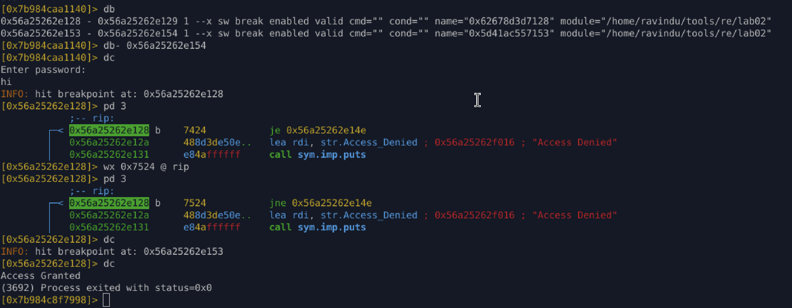

# Lab03 — Runtime Branch Manipulation (PIE + ASLR)

## Objective

Bypass a password check in a **fully hardened PIE binary** by manipulating conditional branches at runtime using radare2, without disabling protections or statically patching the file.

---

## Environment & Protections

* Arch: amd64
* PIE: Enabled
* ASLR: Enabled
* Stack Canary: Enabled
* RELRO: Full
* Stripped: Yes
* Optimized: `-Ofast`

---

## Target Instruction

The password validation result controls a conditional jump:

```
0x56a25262e128  7424   je  0x56a25262e14e
```

Meaning:

* `ZF = 1` → success path
* `ZF = 0` → failure path

---

## Method 1 — Unconditional Jump Override

### Idea

Force execution into the success path by replacing a conditional jump (`je`) with an unconditional jump (`jmp`) at runtime.

### Steps

1. Run binary under debugger:

   ```
   r2 -d ./lab02
   ```

2. Set breakpoint at decision point:

   ```
   db 0x56a25262e128
   dc
   ```

3. Verify instruction:

   ```
   pd 3
   ```

4. Patch jump:

   ```
   wa jmp 0x56a25262e155 @ 0x56a25262e128
   ```

5. Continue execution:

   ```
   dc
   ```

### Result

```
Access Granted
Process exited with status=0x0
```


### Key Insight

* PIE and ASLR do not matter once execution reaches runtime addresses.
* Stack canary remains intact.
* Control-flow logic is overridden cleanly.

---

## Method 2 — Conditional Inversion (JE → JNE)

### Idea

Invert the condition instead of forcing a jump:

* Change `je` → `jne`
* Now failure becomes success without modifying target address.

---

### Steps

1. Confirm current instruction:

   ```
   pd 3 @ rip
   ```

   ```
   7424  je 0x56a25262e14e
   ```

2. Overwrite opcode:

   ```
   wx 0x7524 @ rip
   ```

   Opcode change:

   * `0x74` → `0x75`
   * `je` → `jne`

3. Verify patch:

   ```
   pd 3
   ```

4. Continue execution:

   ```
   dc
   ```

---

### Result

```
Access Granted
Process exited with status=0x0
```



---

## Comparison of Techniques

| Method   | Description                         | Pros                     | Cons                                |
| -------- | ----------------------------------- | ------------------------ | ----------------------------------- |
| Method 1 | Replace conditional jump with `jmp` | Guaranteed success       | Requires knowing success target     |
| Method 2 | Invert jump condition (`je → jne`)  | Minimal change, stealthy | Depends on control flow correctness |

---

## Lessons Learned

* Hardenings protect memory corruption, not logic.
* PIE + ASLR are irrelevant after runtime resolution.
* Conditional jumps are high-value targets.
* Opcode-level patches are safer than blind instruction removal.
* radare2 allows exploit-grade runtime manipulation without gdb.

---

## r2 Commands Used

* `db`, `db-`
* `dc`
* `pd`
* `wx`
* `wa`
* `rip`

---

## Mental Model Gained

> “Do not fight protections — wait until execution reveals truth, then control it.”

---
