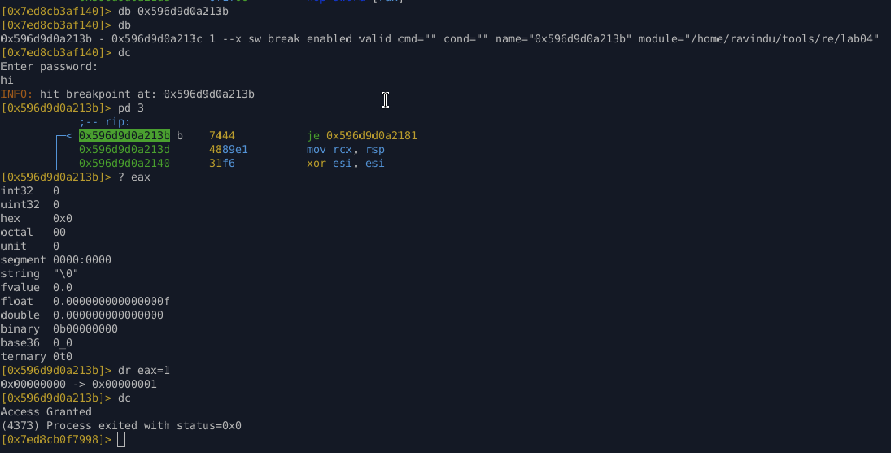
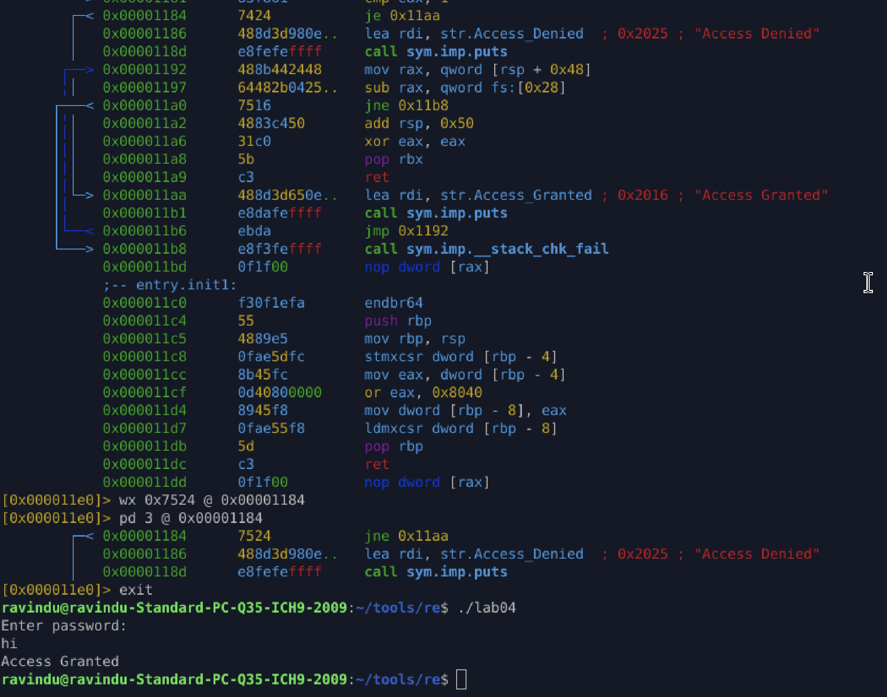

# Lab04 — Obfuscated Control Flow & Flag-Based Decisions

## Objective

Bypass a password-protected binary where:

* No direct `strcmp` branch exists
* Control flow is distorted by compiler optimizations
* Final decision depends on register values and flags
* r2 graph view is misleading

The goal is to identify the **real decision point** and bypass it using **runtime manipulation** and **static patching**.

---

## Binary Protections

* Arch: amd64
* PIE: Enabled
* ASLR: Enabled
* Stack Canary: Enabled
* RELRO: Full
* Optimized: `-Ofast -flto`
* Stripped: Yes

---

## Key Discovery

The final decision is **not a simple jump after a comparison**.

Instead, the compiler emits:

```
cmove eax, edx
cmp   eax, 1
je    success
```

Meaning:

* The result is stored in a **register**
* The jump depends on a **value moved conditionally**
* Earlier logic manipulates `eax` indirectly
* Static structure is misleading

This is why graph view lies.

---

## Method 1 — Runtime Register Manipulation (Temporary Bypass)

### Idea

Force the success condition by modifying the decision register **at runtime**, without patching the binary.

### Steps

1. Run under debugger:

```
r2 -d ./lab04
```

2. Let execution reach decision point:

```
dc
```

3. Break at the conditional jump:

```
db 0x56b8a1dd113b
```

4. Inspect instruction:

```
pd 2
```

```
je 0x56b8a1dd1181
```

5. Force condition manually:

```
dr eax=1
```

6. Continue execution:

```
dc
```

### Result

```
Access Granted
Process exited with status=0x0
```

### Characteristics

* No file modification
* Works despite PIE + ASLR
* Perfect for live analysis and proof-of-concept
* Lost after program exit


---

## Method 2 — Static Opcode Patch (Permanent Bypass)

### Idea

Invert the final decision branch so that **failure becomes success permanently**.

---

### Target Code

```
0x00001181  cmp eax, 1
0x00001184  je  0x11aa   ; success
```

Failure path prints `"Access Denied"`.

---

### Patch

Invert the conditional jump:

```
wx 0x7524 @ 0x00001184
```

Opcode change:

* `0x74` → `0x75`
* `je` → `jne`

---

### Verification

```
pd 3 @ 0x00001184
```

```
jne 0x11aa
```

---

### Result

```
./lab04
Enter password:
hi
Access Granted
```

✔ Permanent
✔ Canary intact
✔ Clean program exit


---

## Why This Lab Is Important

This lab demonstrates **real-world optimized binary behavior**:

* Logic is encoded as *effects*, not structure
* Conditions are split across blocks
* Registers carry semantic meaning
* Flags are reused far from branches
* Graph-based reversing is unreliable

---

## Lessons Learned

* Optimized binaries do not express intent clearly
* Registers can be more important than jumps
* `cmov` hides decisions from control-flow graphs
* Runtime truth beats static assumptions
* r2 is powerful but dangerous if trusted blindly

---

## Mental Model Gained

> “The compiler does not preserve logic — it preserves results.”

This is the **exact mindset** used in:

* DRM reversing
* Malware analysis
* Exploit development
* License check bypasses

---

## r2 Commands Used

* `r2 -d`
* `db`, `dc`
* `pd`
* `dr`
* `wx`
* `ood`

---
