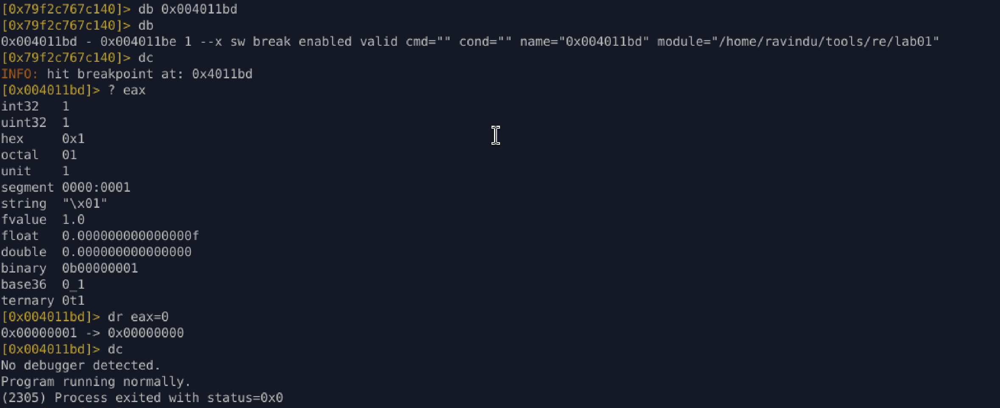
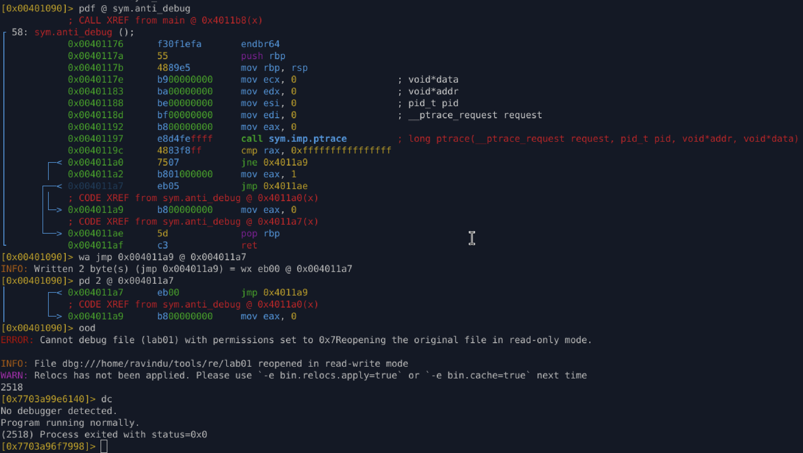

# Lab 01 – Ptrace Check (Anti-Debugging)

## Overview

This lab demonstrates a **classic anti-debugging technique** using the Linux `ptrace` system call.
The binary attempts to detect whether it is being executed under a debugger and alters its control flow accordingly.

The focus of this lab is **understanding control-flow decisions**, **register semantics**, and both **temporary and permanent bypass strategies** using **radare2**.

---

## Anti-Debugging Technique Used

### `ptrace(PTRACE_TRACEME)`

* When a program calls:

  ```c
  ptrace(PTRACE_TRACEME, ...)
  ```
* The kernel returns:

  * `-1` → if the process is already being traced (debugger attached)
  * `>= 0` → if no debugger is present

This makes `ptrace` a simple and effective debugger detection mechanism.

---

## High-Level Logic

1. The function `anti_debug()` calls `ptrace`
2. It checks the return value
3. It returns:

   * `1` → debugger detected
   * `0` → no debugger
4. `main()` evaluates this return value and decides execution flow

---

## Key Assembly Logic (anti_debug)

```asm
call sym.imp.ptrace
cmp rax, -1
jne no_debugger
mov eax, 1
jmp end
no_debugger:
mov eax, 0
ret
```

### Meaning:

* `rax == -1` → debugger present → return `1`
* otherwise → return `0`

---

## Control Flow in `main`

```asm
test eax, eax
je no_debugger_path
```

* `test eax, eax` sets flags based on `eax`
* `je` (jump if zero) is taken when `eax == 0`
* Therefore:

  * `eax == 0` → normal execution
  * `eax != 0` → debugger detected → exit

---

## Temporary Bypass (Runtime)

### Technique

Manipulate the return value **at runtime** without modifying the binary.

### Steps (radare2)

1. Set a breakpoint before the `test eax, eax`
2. Inspect the register:

   ```r2
   ? eax
   ```
3. Force execution path:

   ```r2
   dr eax=0
   ```
4. Continue execution

### Result

The program follows the **no-debugger path**, even while being debugged.

✔ Useful for live analysis\
✔ No binary modification\
✔ Ideal during exploration



## Permanent Bypass (Stealth Patch)

### Strategy

Instead of removing the `ptrace` call or NOP-ing instructions, the control flow is **redirected** to always select the “no debugger” return path.

### Patch Applied

Redirect:

```asm
jmp end
```

to:

```asm
jmp no_debugger
```

### Result

```asm
mov eax, 0
ret
```

The anti-debug function always reports **no debugger**, while the original logic remains mostly intact.



## Why This Patch Is Stealthy

* No API calls removed
* No suspicious NOP sleds
* No function elimination
* Minimal byte changes
* Control flow preserved

This mirrors **real-world anti-debug bypass techniques** used in malware analysis and exploit research.

---

## Key Takeaways

* `ptrace` is a simple but powerful debugger detection method
* Anti-debugging often relies on **return values + conditional jumps**
* Temporary bypass is useful during analysis
* Permanent bypass should be:

  * minimal
  * stealthy
  * control-flow aware
* radare2 is sufficient for both **dynamic inspection** and **binary patching**

