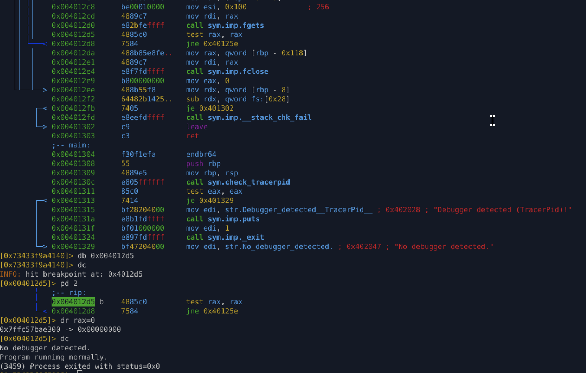
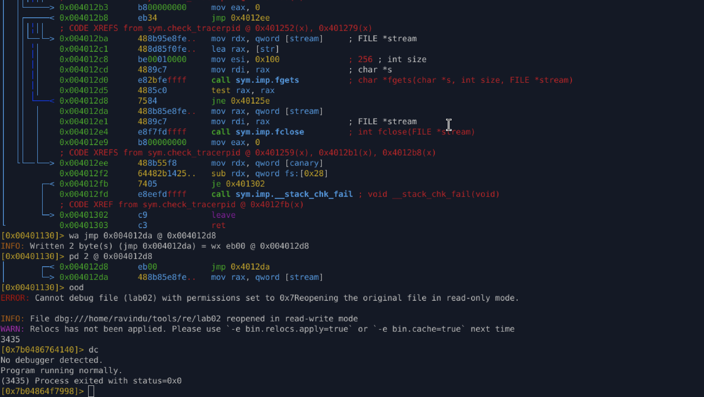

# Lab 02 – TracerPid Check (`/proc/self/status`)

## Overview

This lab demonstrates a **real-world anti-debugging technique** that detects debuggers by inspecting kernel-exposed process metadata via `/proc/self/status`.

Unlike `ptrace`-based checks, this method:

* Does **not** rely on system call failure
* Works even when `ptrace` is patched or bypassed
* Appears as legitimate file I/O
* Commonly introduces **analysis side-effects** (e.g., infinite loops)

This technique is widely used in **Linux malware, loaders, packers, and crackmes**.

---

## Anti-Debugging Technique Used

### TracerPid Inspection

The kernel exposes the current tracing process ID via:

```
/proc/self/status
```

Relevant field:

```
TracerPid: <pid>
```

* `0` → not being traced
* `>0` → debugger attached

The program reads this file line-by-line, locates the `TracerPid` entry, converts it to an integer, and makes a control-flow decision.

---

## High-Level Logic

1. Open `/proc/self/status`
2. Read the file using `fgets` in a loop
3. Search for the `"TracerPid:"` line
4. Convert its value using `atoi`
5. Return:

   * `1` → debugger detected
   * `0` → no debugger

The `main` function then exits or continues based on this return value.

---

## Core Loop Logic (Assembly)

```asm
call sym.imp.fgets
test rax, rax
jne  loop_start
```

### Meaning

* `fgets()` returns:

  * non-NULL → line read successfully
  * NULL → EOF or error
* As long as `rax != 0`, execution loops

---

## Real-World Side Effect: Infinite Loop Under Debugger

While debugging:

* `/proc/self/status` is **always readable**
* `fgets()` continuously returns a valid pointer
* The loop **never terminates**

This results in:

* Apparent “hang”
* No explicit crash
* Analyst confusion

✔ This is **intentional behavior**\
✔ This mirrors real malware anti-analysis tricks\
✔ The loop itself becomes a defense mechanism

---

## Temporary Bypass (Runtime)

### Strategy

Force `fgets()` to appear as if it returned `NULL`, simulating end-of-file.

### Method (radare2)

Break before the loop condition and modify the return value:

```r2
dr rax=0
```

This causes:

* `test rax, rax` → zero
* Loop exit
* Normal function return

### Result

Program continues execution normally even under a debugger.

---



## Permanent Bypass (Stealth Patch)

### Patch Point

```asm
test rax, rax
jne loop_start
```

### Applied Patch

Redirect the conditional jump to the cleanup path:

```asm
jne loop_start
↓
jmp cleanup
```

Binary patch:

```asm
eb 00
```

---

## Why This Patch Is Stealthy

* No removal of file I/O
* No modification of string comparisons
* No alteration of integer parsing
* Stack canary logic preserved
* Minimal byte change
* Control flow remains realistic

The function still *appears* to behave normally, but the loop-based anti-debug condition is neutralized.

---

## Control Flow in `main`

```asm
call sym.check_tracerpid
test eax, eax
je normal_path
```

* `eax == 0` → no debugger → continue
* `eax != 0` → debugger detected → `_exit(1)`

After patching, `check_tracerpid` reliably returns `0`.

---



## Key Takeaways

* Anti-debugging can be **implicit**, not explicit
* File I/O loops can act as analysis traps
* Understanding libc return semantics is critical
* Runtime bypass is ideal for exploration
* Permanent bypass should:

  * target control flow
  * preserve semantics
  * minimize footprint

---
