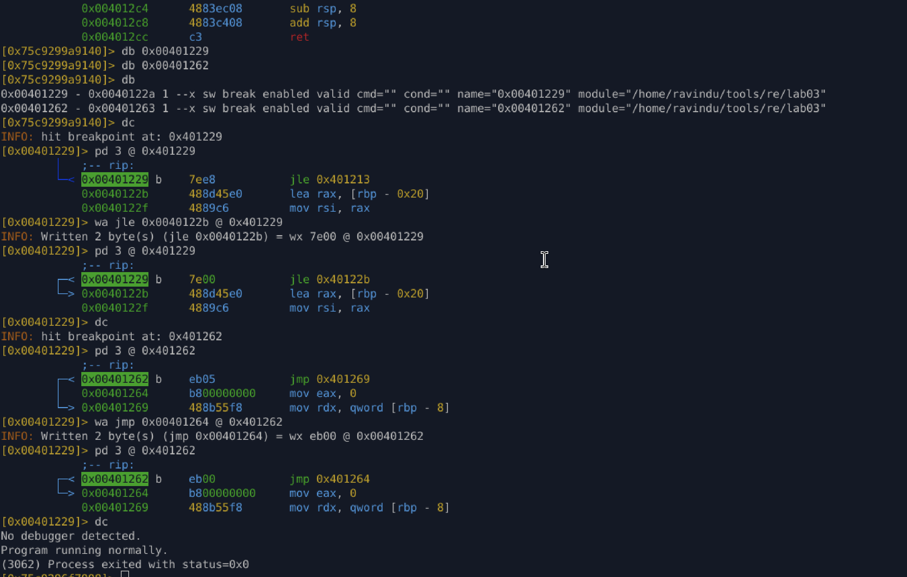

# Lab 03 – Timing-Based Anti-Debugging

## Overview

This lab demonstrates a **real-world timing-based anti-debugging technique** used to detect debugging activity by measuring **execution delays** rather than debugger presence.

Unlike `ptrace` or `/proc`-based checks, this technique:

* Detects **human analysis behavior**
* Triggers on breakpoints and single-stepping
* Does not rely on kernel flags or APIs
* Produces no crashes or obvious failures

Timing-based detection is widely used in **malware, protected loaders, and advanced crackmes**.

---

## Anti-Debugging Technique Used

### High-Resolution Time Measurement

The binary:

1. Captures a timestamp before execution
2. Executes a tight computation loop
3. Captures a timestamp after execution
4. Calculates the elapsed time
5. Compares it against a threshold

Any **analysis-induced delay** (breakpoints, stepping, tracing) inflates the measured delta.

---

## High-Level Logic

```text
start_time = clock_gettime()
execute busy loop
end_time = clock_gettime()
delta = end_time - start_time

if delta > THRESHOLD:
    debugger detected
else:
    normal execution
```

---

## Dual-Stage Detection Mechanism

### 1️⃣ Busy-Loop Time Inflation

* Uses a stack-based loop counter
* Iterates up to a high value (`~100k`)
* Any pause inside the loop significantly increases runtime

This loop is intentionally small but **sensitive to delays**, making it an effective anti-analysis mechanism.

---

### 2️⃣ Final Threshold Comparison

After timing calculation:

```asm
cmp eax, 5000000
jg  debugger_detected
```

* `eax` holds elapsed nanoseconds
* Threshold is tuned to trigger under debugging
* Even minor delays can trip detection

This ensures detection **even if the loop completes**.

---

## Key Assembly Logic (Simplified)

### Loop Control

```asm
cmp counter, limit
jle loop_start
```

Controls whether the busy loop continues.

---

### Decision Logic

```asm
cmp delta, threshold
jg debugger_path
mov eax, 0
ret
```

Determines whether execution continues or terminates.

---

## Temporary Bypass (Runtime)

### Strategy

Neutralize both:

* loop delay
* final decision

### Methods Used

1. Patch loop condition at runtime to **exit immediately**
2. Redirect final conditional jump to the “no debugger” return path

This allows:

* Safe debugging
* Live analysis
* No binary modification during exploration

---

## Permanent Bypass (Stealth Patch)

### Patch Locations

* Loop continuation conditional jump
* Final threshold decision jump

### Patch Strategy

* Redirect jumps to **non-delaying** or **safe return paths**
* Preserve original computation and structure
* Avoid patching time APIs or constants

### Result

* Function still executes normally
* Timing logic remains intact
* Detection logic is neutralized

---



## Why This Patch Is Stealthy

* No removal of timing calls
* No modification of thresholds
* No forced early returns
* Minimal byte changes
* Control-flow preserved

This mirrors **real anti-anti-debug techniques** used in malware analysis and reverse engineering.

---

## Key Takeaways

* Timing-based checks detect **behavior**, not tools
* Busy loops are effective anti-analysis primitives
* Anti-debugging often uses **multiple layers**
* Runtime bypass validates understanding
* Permanent bypass should:

  * target decision points
  * preserve semantics
  * minimize footprint

---