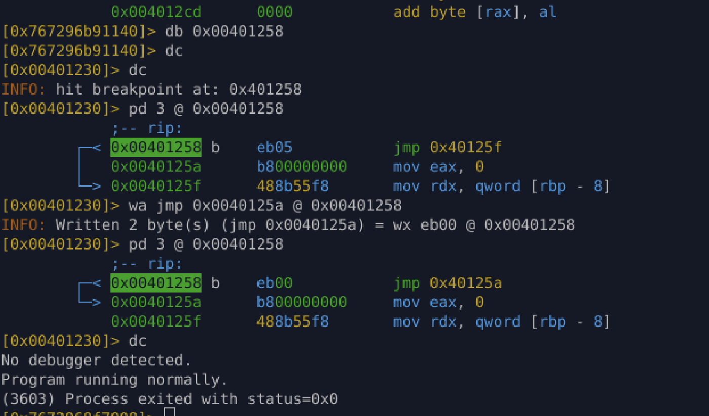

# Lab 03.4 – INT3 (SIGTRAP) Anti-Debugging Check

**Tool focus:** radare2\
**Type:** Real-world anti-debugging (signal + trap based)

---

## Objective

Understand and bypass an **INT3-based anti-debugging mechanism** that relies on:

* `int3` instruction
* `SIGTRAP` signal handling
* Runtime state (`trap_handled` flag)
* Conditional control-flow decision

This technique is commonly used in **malware, protectors, and crackme-style binaries**.

---

## Anti-Debugging Concept

### How INT3 works

* `int3` (`0xCC`) triggers a **SIGTRAP**
* Under **normal execution**:

  * Custom `SIGTRAP` handler runs
  * Handler sets a global flag
* Under **debugger**:

  * Debugger intercepts SIGTRAP
  * Handler never executes
  * Flag remains unset

The program later checks this flag to decide if a debugger is present.

---

## Key Function: `int3_check`

Relevant disassembly:

```asm
call sigaction          ; install SIGTRAP handler
int3                   ; trigger SIGTRAP
call sigaction          ; restore handler

mov eax, [trap_handled]
test eax, eax
jne 0x40125a            ; handler ran → no debugger
mov eax, 1              ; debugger detected
jmp 0x40125f
mov eax, 0              ; no debugger
```

### Logical representation:

```c
if (trap_handled != 0)
    return 0;   // no debugger
else
    return 1;   // debugger detected
```

---

## Behavior Under Debugger

| Environment | SIGTRAP            | trap_handled | Result            |
| ----------- | ------------------ | ------------ | ----------------- |
| Normal run  | handled by program | 1            | No debugger       |
| GDB / r2    | intercepted        | 0            | Debugger detected |

---

## Bypass Strategy

Instead of:

* Removing `int3`
* NOPing logic
* Hooking signals

**Patch the final decision point**

### Target instruction:

```asm
0x00401258 eb 05   jmp 0x40125f
```

### Patch applied:

```asm
jmp 0x40125a
```

This forces execution to:

```asm
mov eax, 0
```

So the function **always returns “no debugger”**, regardless of actual detection.

---

## radare2 Patch Commands

```sh
db 0x00401258
dc

pd 3 @ 0x00401258

wa jmp 0x0040125a @ 0x00401258
```

Verification:

```asm
0x00401258 eb 00   jmp 0x40125a
0x0040125a b800000000  mov eax, 0
```

Program output:

```
No debugger detected.
Program running normally.
```

---



## Why This Patch Is Stealthy

* No NOP sleds
* No removed instructions
* Control-flow remains valid
* Binary behavior appears normal
* Harder to spot in diff or review

This mimics **compiler-generated control-flow**, making it suitable for real-world patching.

---

## Key Takeaways

* INT3 anti-debugging relies on **signal ownership**
* Debuggers break logic by intercepting signals
* Anti-debug checks usually collapse into:

  * One variable
  * One branch
  * One return value
* Best patches target **decision points**, not mechanisms

---

## Skill Gained

* Signal-based anti-debug analysis
* Identifying post-detection decision logic
* Minimal, stealthy binary patching
* Real malware-style reversing mindset

---