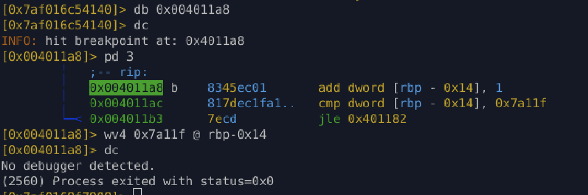
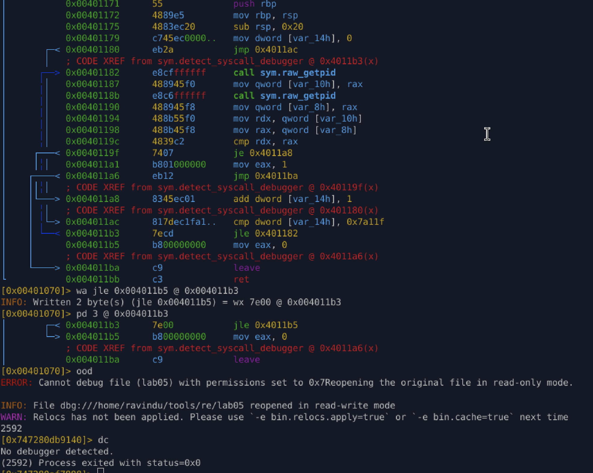

# Lab 05 – Syscall Breakpoint Detection (Pressure-Based)

## Category

**Anti-Debugging / Anti-Analysis (Syscall-Level Pressure)**

---

## Objective

To analyze and bypass a **real-world syscall-based anti-debugging technique** that does **not directly detect a debugger**, but instead applies heavy execution pressure to:

* Slow down debuggers
* Punish stepping or syscall breakpoints
* Force analysts to patch logic
* Waste analysis time

---

## Technique Overview

The binary performs:

* Two **raw syscalls** (`syscall; getpid`)
* Direct kernel interaction (no libc)
* A comparison between consecutive syscall return values
* A **large iteration loop (~500,000 iterations)**

### Key behavior:

* `getpid()` always returns the same value
* No incorrect syscall return values under debugging
* Loop always completes
* Program exits normally if loop finishes

This confirms the technique is **pressure-based**, not value-based detection.

---

## Key Insight

This anti-debugging method is **not meant to instantly detect a debugger**.

Instead, it:

* Makes stepping impractical
* Breaks syscall-level tracing workflows
* Forces runtime or permanent patching
* Acts as an anti-analysis delay layer

This pattern is commonly used in:

* Malware loaders
* Packers
* DRM-protected binaries

---

## Disassembly Highlights

```asm
call raw_getpid
mov [pid1], rax
call raw_getpid
mov [pid2], rax
cmp pid1, pid2
je loop_continue
```

Loop logic:

```asm
add counter, 1
cmp counter, 0x7a11f
jle loop_start
```

* Counter upper bound ≈ 499,999
* Loop executes fully under normal and debug execution
* No debugger detection by syscall value

---

## ⚡ Runtime Bypass Strategy

### Goal

Exit the loop immediately **without altering program logic**.

### Method

Force the loop counter to its terminal value at runtime.

```r2
wv4 0x7a11f @ rbp-0x14
```

### Result

* Loop exits instantly
* Function returns cleanly
* No syscall modification
* No visible logic corruption

---



## Permanent Patch Strategy

### Target

Loop continuation condition:

```asm
cmp counter, 0x7a11f
jle loop_start
```

### Patch

Redirect the conditional jump to the loop-exit path:

```r2
wa jle 0x004011b5 @ 0x004011b3
```

### Result

* Loop is skipped
* Function returns `eax = 0`
* Execution flow preserved
* No NOPs used
* Patch is stealthy and minimal

---



## Why This Patch Is Effective

* Preserves function semantics
* Avoids syscall tampering
* Maintains believable control flow
* Harder to detect during integrity checks
* Matches real-world analyst techniques

---

## Final Classification

> **Syscall pressure-based anti-debugging**
> A non-fatal anti-analysis technique that delays debugging by forcing heavy execution loops rather than detecting debugging via syscall return values.

---

## Lessons Learned

* Not all anti-debugging is value-based
* Pressure techniques are designed to waste analyst time
* Correct response is logic bypass, not brute force
* Stealthy control-flow patches are preferred over NOP spraying

---