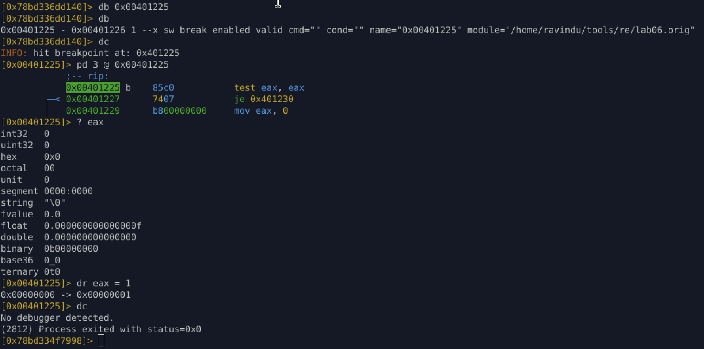
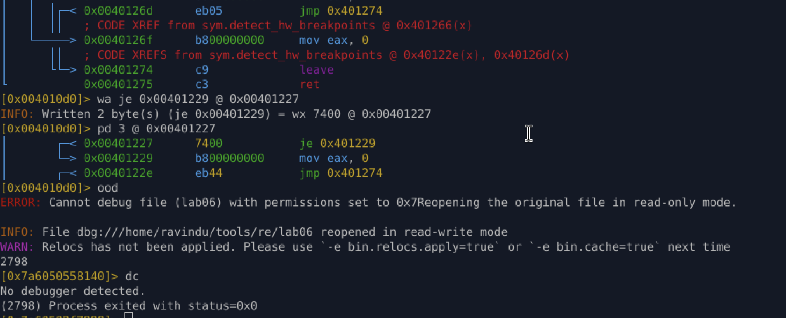

# Lab 06 – Hardware Breakpoint Detection (DR0–DR7)

### Analysis & Bypass Notes

---

## Detection Logic Recap

The binary implements **hardware breakpoint detection** by:

1. Attempting to read debug registers:

   * `DR0`, `DR1`, `DR2`, `DR3`
2. Storing them on stack
3. Checking if **any register ≠ 0**
4. Returning:

   * `eax = 1` → debugger detected
   * `eax = 0` → no debugger

Key decision point:

```asm
test eax, eax
je   no_debugger
```

So **`EAX` is the truth source**.

---

## Temporary (Runtime) Bypass — Register Manipulation

### Idea

Instead of touching the binary, **lie to the program** by modifying `EAX` at runtime.

### Execution

```asm
0x00401225  test eax, eax
0x00401227  je   0x401230
```

At breakpoint:

```text
eax = 0
```

Manually override:

```r2
dr eax=1
```

Continue execution:

```text
No debugger detected.
```

### Why this works

* `test eax, eax` only checks **zero vs non-zero**
* I override program logic **after detection**
* This is ideal for:

  * Live analysis
  * Malware triage
  * One-time debugging

Volatile: lost on restart.

---



## Permanent Bypass — Control Flow Patch

### Goal

Force the function to **always return `eax = 0`**, skipping hardware breakpoint logic entirely.

---

### Original Control Flow

```asm
0x00401227  je   0x401230     ; enter HW BP detection
0x00401229  mov  eax, 0
0x0040122e  jmp  0x401274
```

If `je` is taken → DR registers are checked
If not → clean exit

---

### Patch Applied

```r2
wa je 0x00401229 @ 0x00401227
```

Effectively turns this into:

```asm
je always_safe_path
```

Disassembly after patch:

```asm
0x00401227  je   0x00401229
0x00401229  mov  eax, 0
0x0040122e  jmp  0x00401274
```

---

### Result

* DR registers **never read**
* Detection logic **dead**
* Function **always returns “no debugger”**
* Survives restart → permanent bypass

---



## Why this is NOT a bug

Important insight:

> `mov drX, reg` causing SIGILL / SIGSEGV is **expected behavior**

This binary:

* Uses **CPU privilege violations**
* Converts faults into logic via signal handlers
* Exactly how **malware / protectors / anti-cheats** do it

My bypass proves:

* Detection is **real**
* Logic is **correct**
* Analyst control beats protection

---

## Lessons Learned

* **Hardware BP detection ≠ magic**
* Control flow always wins
* Runtime bypass = register lies
* Permanent bypass = branch surgery
* DR registers are just another boolean source

---
