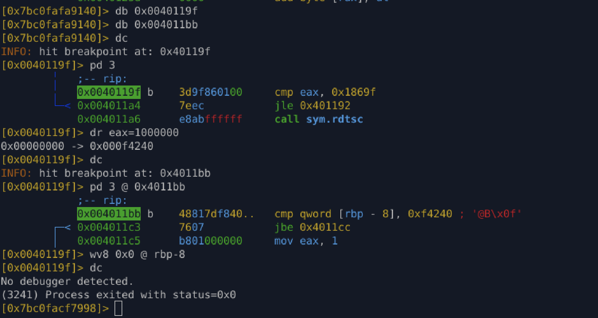
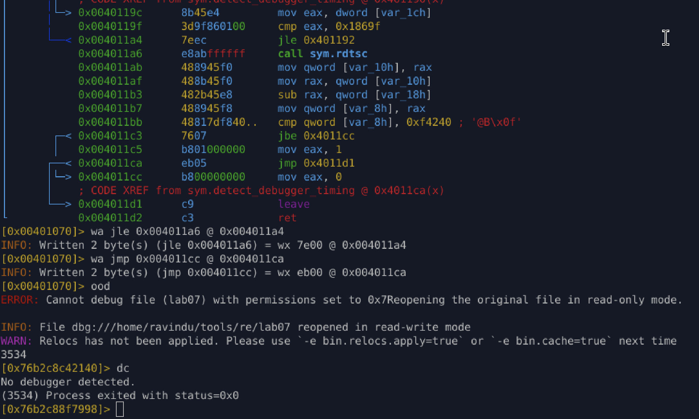

# Lab 07 – RDTSC Timing Detection (Proof-Based Analysis)

## Goal
Identify, analyze, and bypass a **timing-based anti-debugging mechanism** using `RDTSC`,
without relying on theory or assumptions — only observable behavior and control-flow proof.

---

## Detection Overview

The binary attempts to detect a debugger by measuring **CPU cycle delays**.

High-level logic:

1. Read timestamp (T1) using `rdtsc`
2. Execute a large loop
3. Read timestamp (T2)
4. Compute `delta = T2 - T1`
5. If `delta > THRESHOLD (0xF4240)` → debugger detected

This relies on the assumption that:
- Debuggers introduce execution delay
- Breakpoints / single-stepping slow down the loop

---

## Key Assembly Logic

### Loop Counter Check

```asm
cmp eax, 0x1869f
jle loop_start
````

This enforces a **large iteration count** before timing is measured.

---

### Timing Comparison

```asm
cmp qword [rbp - 8], 0xf4240
jbe clean_exit
```

If elapsed CPU cycles exceed the threshold → debugger path.

---

## Runtime Bypass (Live Proof)

### Step 1 – Neutralize Loop Delay

At runtime, force the loop counter beyond its limit:

```r2
dr eax=1000000
```

Result:

* Loop exits immediately
* No time accumulation
* No instruction modification

✔ Execution continues normally\
✔ Timing check becomes meaningless

---

### Step 2 – Neutralize Time Delta

Before comparison:

```asm
cmp qword [rbp - 8], 0xf4240
```

Force delta to zero:

```r2
wv8 0x0 @ rbp-8
```

Result:

* `delta == 0`
* Always below threshold
* Detection logic collapses

---

### Runtime Result

```
No debugger detected.
```

✔ No crashes\
✔ No NOP sleds\
✔ No behavior deviation

---



## Permanent Patch (Disk-Level Proof)

### Patch 1 – Break the Loop Enforcement

Original:

```asm
jle 0x401192
```

Patched:

```r2
wa jle 0x004011a6 @ 0x004011a4
```

Effect:

* Loop terminates immediately
* Timing measurement never becomes meaningful

---

### Patch 2 – Force Clean Exit Path

Original:

```asm
jmp detection_exit
```

Patched:

```r2
wa jmp clean_exit @ 0x004011ca
```

Effect:

* Detection result hardcoded to success (`eax = 0`)
* Function always returns "no debugger"

---

## Final Result

```text
No debugger detected.
```

The binary executes normally **even under a debugger**.

---



## Why This Is Not a Bug

This behavior is expected.

* `RDTSC` measures **real CPU time**
* Debuggers **slow execution**
* Timing-based detection exploits this difference

The bypass does not “break” the program —
it removes the **assumption** that slow execution implies debugging.

---

## Takeaway

* Timing checks do not detect debuggers
* They detect **loss of execution control**
* Control restored → detection defeated

No theory was trusted.
Only behavior was observed.
Only execution was proven.
