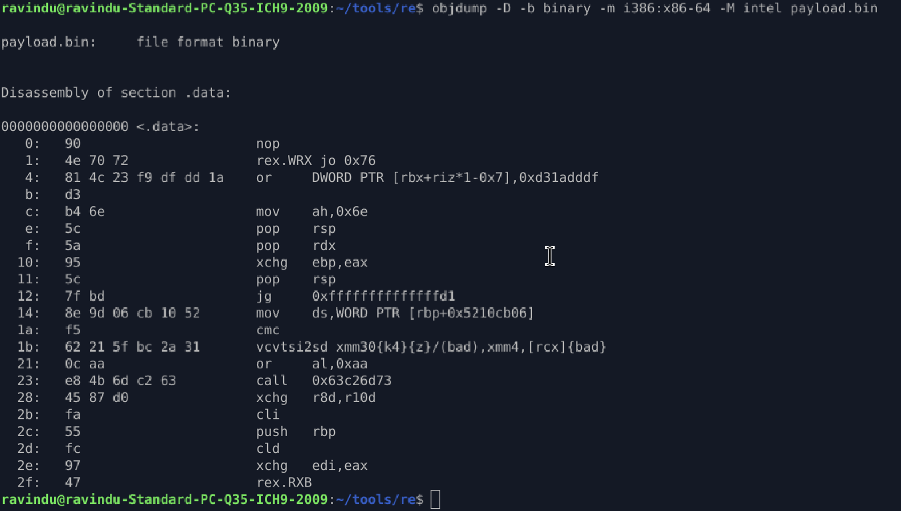
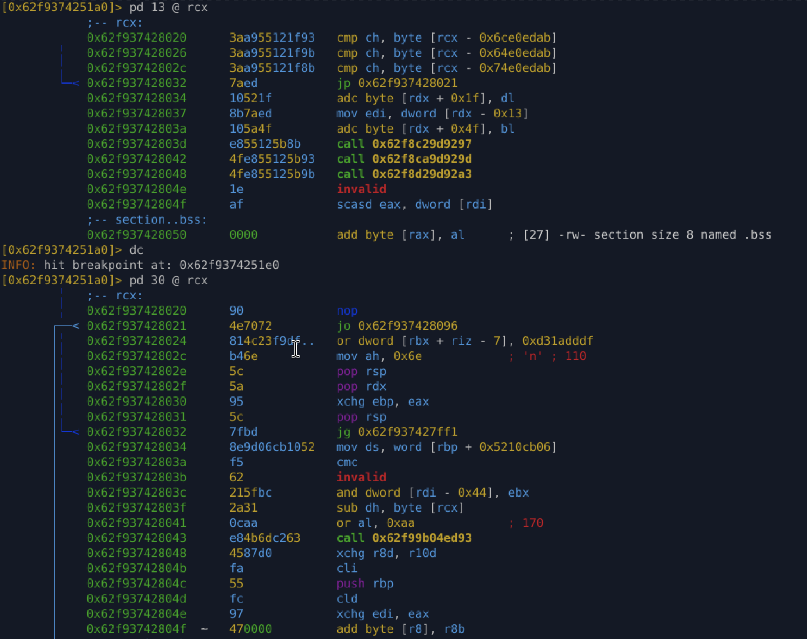

# Lab 04-1 — Self-Modifying Malware (Runtime Decryption)

## Objective

Analyze a **self-modifying ELF binary** where the real payload:

* exists only in **encrypted form** on disk
* is **decrypted at runtime**
* is executed from **non-code memory**
* produces **misleading static disassembly**

The goal is to prove that **static analysis is unreliable** and that **runtime state is the truth**.

---

## What This Binary Does (High Level)

1. Stores encrypted shellcode inside `.data`
2. Calls `mprotect()` to make data memory executable
3. XOR-decrypts the payload **in place**
4. Jumps directly into the decrypted bytes
5. May crash (segfault) after execution — intentionally ignored

This mirrors **real malware loader behavior**.

---

## Why Static Disassembly Looks Insane

When extracting the payload and running:

```bash
objdump -D -b binary -m i386:x86-64 -M intel payload.bin 
```

We see output like:



### This is **expected**, not a mistake.

---

## Why This Happens (Critical Concept)

### 1. The bytes are **encrypted**

Before execution, the payload bytes are:

* **not real instructions**
* just random-looking data

Disassemblers:

* **must assume** bytes are code
* will decode *anything* into *something*

Result: **nonsense instructions**

---

### 2. x86-64 decoding is extremely permissive

x86:

* variable-length instructions
* overlapping prefixes
* no strict validation

So encrypted bytes become:

* weird `rex` prefixes
* invalid memory operands
* random jumps
* bogus SIMD ops

Disassembler is **doing its job correctly** — the data is lying.

---

### 3. Static tools cannot see runtime mutation

At rest:

* payload = encrypted
* instructions = fake

At runtime:

* XOR loop transforms bytes
* memory now contains **real shellcode**
* CPU executes **different instructions**

Static view ≠ runtime reality.

This is the **core lesson of the lab**.

---

## Why This Is a Real Malware Technique

This exact pattern is used to:

* break signature-based detection
* poison static disassembly
* waste analyst time
* force dynamic analysis

Many real samples:

* never store real code on disk
* decrypt only moments before execution
* crash after payload runs

---

## About the Segmentation Fault

A segfault after execution is **normal** in this lab.

Reasons:

* payload doesn’t return cleanly
* stack is corrupted
* execution flows into unmapped memory
* only one page was marked executable

Malware often:

* doesn’t care about graceful exit
* only cares that payload runs once

A crash **does not mean failure**.

---

