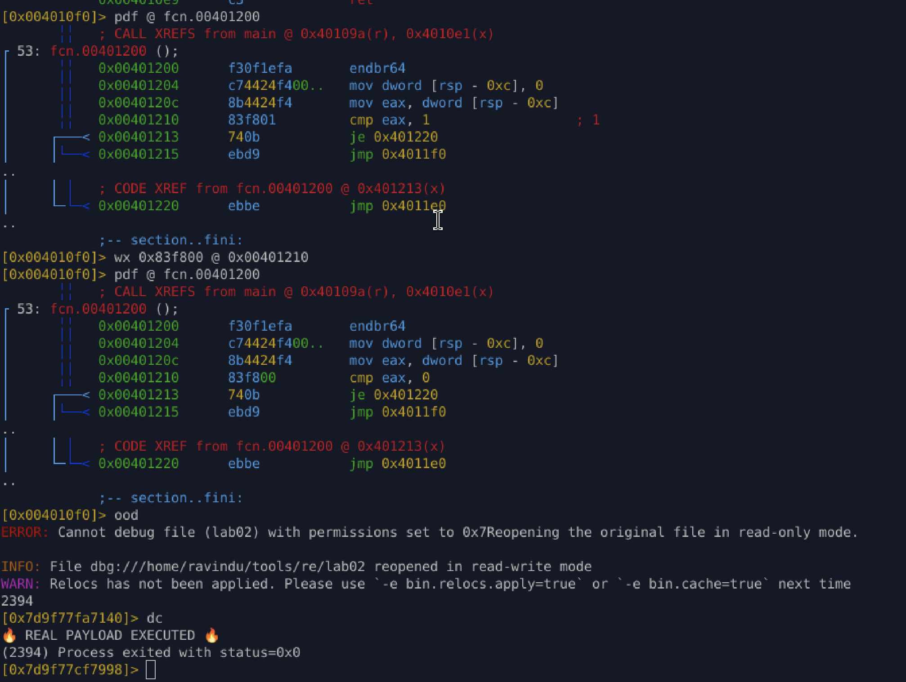

# Lab 04-2 — Self-Patching Control Flow (Runtime Code Rewrite)

## Objective

Demonstrate how a binary alters execution flow at runtime by modifying control-flow conditions, making static analysis unreliable and forcing dynamic inspection to reveal the real payload path.

---

## Key Concept

Static disassembly suggests the real payload is unreachable due to a constant comparison.
At runtime, execution behavior diverges by altering register state or patching comparison logic, redirecting control flow to the hidden payload.

> **Runtime state is the source of truth — static CFGs can lie.**

---

## Static Analysis Summary

The function initializes a local variable and performs a conditional branch:

```asm
mov dword [rsp-0xc], 0
mov eax, [rsp-0xc]
cmp eax, 1
je  secret_path
jmp fake_path
```

* `eax` is always `0`
* `cmp eax, 1` always fails
* Static CFG marks `secret_path` as unreachable

All static tools confirm only the fake path should execute.

---

## Dynamic Analysis (Runtime Manipulation)

At runtime, the register state is manually modified:

```text
dr eax = 1
```

This causes:

* `cmp eax, 1` → ZF = 1
* `je` taken
* Execution jumps into the real payload

**Result:**

```
🔥 REAL PAYLOAD EXECUTED 🔥
```

This confirms execution behavior depends on runtime state, not static values.

---

## Permanent Binary Patch

The comparison instruction was patched on disk:

```text
Original: cmp eax, 1  ; 83 f8 01
Patched:  cmp eax, 0  ; 83 f8 00
```

Effect:

* Condition always evaluates true
* Payload path executes without runtime manipulation
* Patch persists across executions



---

## Analyst Takeaways

* Static disassembly alone is insufficient against self-patching logic
* Control flow graphs can be intentionally misleading
* Malware can gate payload execution behind runtime-dependent conditions
* Runtime debugging and memory inspection are mandatory for truth

---

## Skills Trained

* Runtime control-flow analysis
* Register manipulation during execution
* Binary patching (logic alteration)
* Distinguishing static vs dynamic execution paths
* Malware anti-analysis pattern recognition

---

## Conclusion

This lab demonstrates a common malware technique where control flow is deliberately falsified at rest and corrected only at runtime. Analysts must rely on live execution, not static assumptions, to uncover true program behavior.

---
