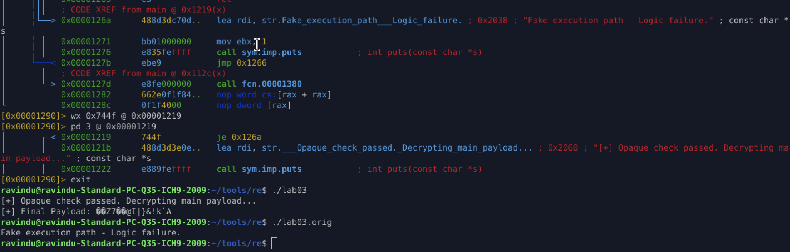

# Lab 04-3 — Staged Self-Decryption with Opaque Predicate & Debugger Trap

## Overview

This lab simulates **real-world staged malware unpacking**, where execution flow, payload decryption, and final behavior depend on **runtime state**, **opaque logic**, and **anti-debugging checks**.

Static analysis alone is insufficient.
Naive debugging causes **intentional corruption and crash**.

---

### Core Techniques Demonstrated

* Multi-stage XOR decryption with **rolling key schedule**
* Runtime **key derivation dependency** between stages
* **Opaque predicate** gating real execution path
* Linux **TracerPid anti-debug detection**
* Delayed crash to mislead analysts
* Fully **optimized and stripped ELF**

---

### Execution Flow

1. **Anti-Debug Check**

   * Reads `/proc/self/status`
   * If traced → delayed segmentation fault

2. **Stage 1 Decryption**

   * Fixed XOR key (`0xAA`)
   * Reveals key material for Stage 2

3. **Stage 2 Decryption**

   * Key derived dynamically from Stage 1 output
   * Must satisfy opaque predicate to proceed

4. **Opaque Predicate**

   * Non-obvious logical condition
   * Failure leads to fake execution path

5. **Stage 3 Decryption**

   * Final payload decrypted only if predicate passes
   * Output is a raw decrypted buffer (non-ASCII)

---

## Analyst Objectives

* Identify all decryption routines and key schedules
* Recover runtime-derived keys
* Bypass or patch opaque predicate
* Defeat or neutralize anti-debug logic
* Reach real payload execution path
* Dump or reconstruct final decrypted payload

---

## Expected Pitfalls

* Static strings do **not** reveal payload
* Debugging triggers silent corruption or crash
* Payload output is **not printable ASCII**
* Execution appears “fake” unless logic is fixed

---

## Required Skills

* ELF reversing (x86-64)
* Control-flow analysis
* Runtime patching (`wx`, `wa`, or binary editing)
* XOR decryption reconstruction
* Anti-debug bypass strategies

---

## Compilation Details

```bash
gcc -o lab03 lab03.c -O3 -fno-stack-protector -s
strip --strip-all lab03
```

---

## Analyst Note

In real malware, the final decrypted buffer would be:

* copied to RWX memory
* treated as shellcode
* executed dynamically

This lab intentionally **prints the payload** to allow verification after successful analysis.

---


